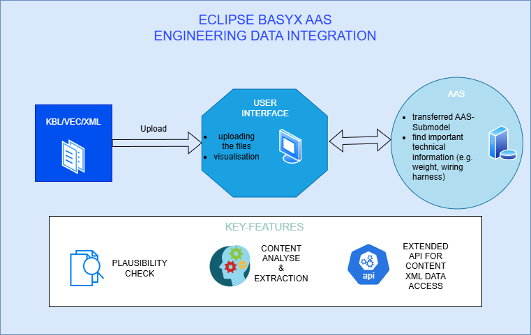
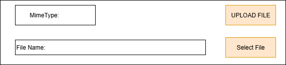
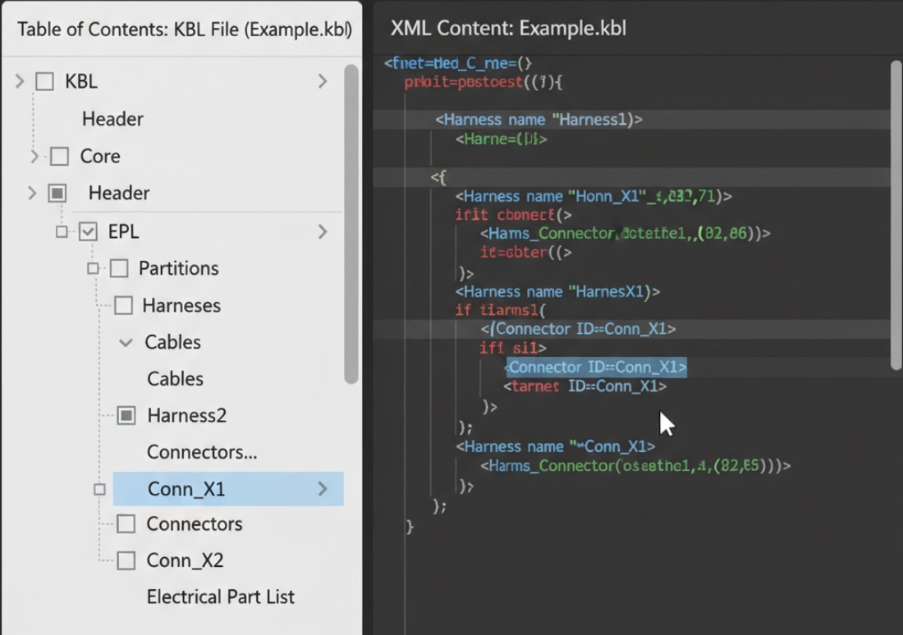
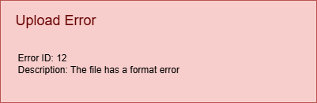

# Customer Requirements Spec (CRS)
## Team3-Basyx-Editor

## Version Control

|Version|Date|Author|Comment|
|-----|-----------|------------|---------------------|
|1.0|12.10.2025|Felix Bandl|first version|
|1.1|13.10.2025|Felix Bandl|priority added|
|1.2|Date|Name|Comment2|
|1.3|Date|Name|Comment3|
|1.4|Date|Name|Comment4|

## Table of contents
1. [Scope](#1-scope)
2. [Introduction](#2-introduction)
3. [Use Cases](#3-use-cases)
   - 3.1 [UC01: Add and link external model file to AAS](#31-uc01-add-and-link-external-model-file-to-aas)
   - 3.2 [UC02: Extract and integrate data from specific model files (KBL/VEC)](#32-uc02-extract-and-integrate-data-from-specific-model-files-kblvec)
   - 3.3 [UC03: Display structured content of an attached XML file](#33-uc03-display-structured-content-of-an-attached-xml-file)
4. [Customer Requirements](#4-customer-requirements)
   - 4.1 [Functional Requirements](#41-functional-requirements)
     - 4.1.1 [FR.001 File Upload and Linking](#411-fr001-file-upload-and-linking)
     - 4.1.2 [FR.002 KBL/VEC Data Extraction](#412-fr002-kblvec-data-extraction)
     - 4.1.3 [FR.003 Automated Population of Submodels](#413-fr003-automated-population-of-submodels)
     - 4.1.4 [FR.004 REST API Extension](#414-fr004-rest-api-extension)
     - 4.1.5 [FR.005 Visualization of structured data](#415-fr005-visualization-of-structured-data)
     - 4.1.6 [FR.006 Error Handling](#416-fr006-error-handling)
   - 4.2 [Non-functional Requirements](#42-non-functional-requirements)
     - 4.2.1 [NFR.001 Usability](#421-nfr001-usability)
     - 4.2.2 [NFR.002 Performance](#422-nfr002-performance)
     - 4.2.3 [NFR.003 Maintainability and Contribution to the Open-Source Project](#423-nfr003-maintainability-and-contribution-to-the-open-source-project)
     - 4.2.4 [NFR.004 Documentation](#424-nfr004-documentation)
     - 4.2.5 [NFR.005 Compatibility](#425-nfr005-compatibility)
     - 4.2.6 [NFR.006 Availability (Demo)](#426-nfr006-availability-demo)
     

## 1. Scope

This document explains the customer's problem and defines the essential project requirements and guidelines. It serves as a foundation and a common reference for all project stakeholders. A further focus is on defining the software requirements from a user and customer perspective, so that the development team understands the product vision and can translate it into tangible functions.

## 2. Introduction

The central goal of this project is the functional extension of the Eclipse BaSyx user interface, particularly the editor and viewer plugins and the corresponding REST API backend. The extension is aimed at users who need a seamless and automated integration of existing engineering data, such as that available in KBL or VEC files, into the Asset Administration Shell (AAS).

At its core, the application should enable users to integrate external model files directly into the AAS. Instead of transferring data manually, the solution creates an efficient workflow in which the files are not only plausibility-checked and correctly linked, but also analyzed in terms of content. Essential information, such as technical data from wire harnesses, is automatically extracted and transferred to standardized submodels. This significantly reduces manual effort and increases data consistency.

Furthermore, the REST API will be extended to allow direct access to data points within attached XML files. This internal data can then be visualized in a structured and user-friendly way in the viewer. The customer benefit thus lies in the creation of a more powerful and intelligent user interface that makes it possible not only to manage complex data from external sources, but also to use and understand it directly in the context of the AAS.

## 3. Use Cases

### 3.1 UC01: Add and link external model file to AAS

| | |
| :--- | :--- |
| **Use Case ID** | UC01 |
| **Description** | The user wants to add an external model file (e.g. CAD, PDF, XML) to an existing Asset Administration Shell (AAS). The user selects a file via the user interface. The application performs a plausibility check and links the file as a `File` element within the AAS, setting the correct MimeType. |
| **Precondition** | The user is in the BaSyx UI editor and has an AAS open for editing. The model file exists on the user's local system. |
| **Postcondition on Success**| The external file is successfully uploaded and linked as a `File` submodel element in the AAS. The `mimeType` attribute of the element correctly reflects the file type. |
| **Triggering Event** | The user starts a file upload action within the editor plugin for a specific AAS or submodel. |

### 3.2 UC02: Extract and integrate data from specific model files (KBL/VEC)

| | |
| :--- | :--- |
| **Use Case ID** | UC02 |
| **Description** | The user wants to add a KBL or VEC file to an AAS. The application analyzes the file content, extracts key information (e.g., nameplate data, weight, technical features) and automatically populates the "General Technical Data" submodel of the AAS with this information. An additional "Generate Technical Data" button is available to start this transfer. |
| **Precondition** | The user has a valid KBL or VEC file. The target AAS exists and can host the "General Technical Data" submodel (or the submodel can be created by the application). |
| **Postcondition on Success**| The KBL/VEC file is linked in the AAS (as in UC01) and the "General Technical Data" submodel is created or updated with the correctly mapped, extracted data points. |
| **Triggering Event** | The user uploads a file with the extension .kbl or .vec and presses the "Generate Technical Data" button, which triggers the specialized process of parsing and extracting the data. |

### 3.3 UC03: Display structured content of an attached XML file

| | |
| :--- | :--- |
| **Use Case ID** | UC03 |
| **Description** | The user wants to inspect the content of an XML file that is already attached to an AAS. The user navigates to the file within the BaSyx Viewer. The system uses the extended REST API to parse the XML file and displays its internal data points in a structured, human-readable format (e.g., similar to Notepad++). |
| **Precondition** | An AAS with a linked XML file exists on the server. The user is currently viewing this AAS in the BaSyx Viewer plugin. |
| **Postcondition on Success**| The structured content of the XML file is displayed clearly and concisely to the user in the viewer interface. |
| **Triggering Event** | The user selects or expands the linked XML file element in the viewer. |

## 4. Customer Requirements
The requirements are described with an ID and an overview to enable the development team to understand and implement them in the development process. Individual requirements are prioritized from 1 to 5 to indicate which requirements are most important to implement. 5 means very important and 1 means not so important.

### 4.1 Functional Requirements

#### 4.1.1 FR.001 File Upload and Linking

| | |
| :--- | :--- |
| **Requirement ID** | FR.001 |
| **Overview** | The application must provide a UI component that allows users to upload external model files. After a successful upload, the file must be linked as a `File` element in the AAS and the correct `mimeType` must be set automatically. |
| **Acceptance Criterion** | A user can select a local file via the UI. The file is uploaded and appears in the AAS structure. The `mimeType` property corresponds to the actual file type. The process handles common file types correctly. |
|**Priority**|4|
| **UI Mockup** |  |

#### 4.1.2 FR.002 KBL/VEC Data Extraction

| | |
| :--- | :--- |
| **Requirement ID** | FR.002 |
| **Overview** | The application must be able to parse uploaded KBL and VEC files to extract predefined information, including nameplate data and important technical specifications (e.g., weight, features). |
| **Acceptance Criterion** | When a valid KBL or VEC file is entered, the application correctly extracts the specified data points. The extracted data can be compared with the source file. The process must be able to handle the defined file schemas. |
|**Priority**|3|

#### 4.1.3 FR.003 Automated Population of Submodels

| | |
| :--- | :--- |
| **Requirement ID** | FR.003 |
| **Overview** | The data extracted from the KBL/VEC files must be automatically used to create or update the "General Technical Data" AAS submodel after pressing the "Generate Technical Data" button. |
| **Acceptance Criterion** | After a KBL/VEC file has been processed, the corresponding AAS contains a "General Technical Data" submodel whose elements (e.g., Weight, Dimensions) are filled with the values from the file. |
|**Priority**|3|

#### 4.1.4 FR.004 REST API Extension

| | |
| :--- | :--- |
| **Requirement ID** | FR.004 |
| **Overview** | The BaSyx REST API must be extended to provide a mechanism for accessing and retrieving structured data from an XML file stored as a `File` element in an AAS. |
| **Acceptance Criterion** | A new API endpoint exists according to the specification in the corresponding GitHub issue. When called with the correct path to an XML file within an AAS, the API returns the file content in a structured format (e.g., JSON). The endpoint can be verified by automated tests. |
|**Priority**|5|

#### 4.1.5 FR.005 Visualization of structured data

| | |
| :--- | :--- |
| **Requirement ID** | FR.005 |
| **Overview** | The viewer plugin must be able to display the internal data points of an attached XML file in a structured, hierarchical view. |
| **Acceptance Criterion** | When a user clicks on a linked XML file in the viewer, a new panel or a new view displays the content of the XML file as a tree structure (similar to Notepad++). The displayed structure correctly reflects the Document Object Model (DOM) of the XML file. |
|**Priority**|4|
| **UI Mockup** |  |

#### 4.1.6 FR.006 Error Handling

| | |
| :--- | :--- |
| **Requirement ID** | FR.006 |
| **Overview** | The system must handle errors, such as uploading faulty or un-processable files, properly. |
| **Acceptance Criterion** | If an attempt is made to process an invalid KBL/VEC file, the application must not crash. It must issue a clear and informative error message to the user explaining the error. API errors must return appropriate HTTP status codes. |
|**Priority**|4|
| **UI Mockup** |  |

### 4.2 Non-functional Requirements

#### 4.2.1 NFR.001 Usability

| | |
| :--- | :--- |
| **Requirement ID** | NFR.001 |
| **Overview** | The new functionalities in the editor and viewer must be intuitive and well integrated into the existing workflow of the BaSyx UI. |
| **Acceptance Criterion** | A user who is familiar with the BaSyx UI can perform the main use cases (uploading a file, viewing XML content) without consulting the documentation. The workflow for each use case is clear and logical. |

#### 4.2.2 NFR.002 Performance

| | |
| :--- | :--- |
| **Requirement ID** | NFR.002 |
| **Overview** | The parsing of the files and the data extraction should be efficient to ensure a responsive user experience. |
| **Acceptance Criterion** | The server-side processing (parsing, extraction, populating the submodel) of a standard-sized model file must be completed in under 5 seconds. The UI provides feedback (e.g., a loading indicator) during this process. |

#### 4.2.3 NFR.003 Maintainability and Contribution to the Open-Source Project

| | |
| :--- | :--- |
| **Requirement ID** | NFR.003 |
| **Overview** | The developed code must comply with the coding standards of the Eclipse BaSyx project and be well documented to facilitate maintenance and future contributions from the open source community. |
| **Acceptance Criterion** | The code follows existing project conventions. All new public classes and methods are documented. The implementation is covered by unit tests. A pull request for the new features is created and submitted to the official BaSyx repositories. |

#### 4.2.4 NFR.004 Documentation

| | |
| :--- | :--- |
| **Requirement ID** | NFR.004 |
| **Overview** | Clear and structured user documentation for the new functionalities must be created. |
| **Acceptance Criterion** | An online user documentation is created. It explains the new functions with step-by-step instructions and screenshots. The tutorials for setting up the BaSyx infrastructure are evaluated and improved where gaps have been identified. |

#### 4.2.5 NFR.005 Compatibility

| | |
| :--- | :--- |
| **Requirement ID** | NFR.005 |
| **Overview** | The extensions must be fully compatible with the target version of the BaSyx UI and the backend infrastructure and must not negatively affect existing functionalities. |
| **Acceptance Criterion** | All existing, unchanged functionalities of the BaSyx UI continue to function as expected after the integration of the new features. The solution can be built and run within the standard BaSyx build chain. |

#### 4.2.6 NFR.006 Availability (Demo)
| | |
| :--- | :--- |
| **Requirement ID** | NFR.006 |
| **Overview** | The final functionalities must be hosted on a publicly accessible demo server and be executable. |
| **Acceptance Criterion** | The Use Cases (UC01-UC03) implemented in the project can be tested live by project stakeholders via a provided URL without requiring a VPN or special software installations.|