# Master Usecase 
## Team3-Basyx-Editor

## Version Control

|Version|Date|Author|Comment|
|-----|-----------|------------|---------------------|
|1.0|07.11.2025|Martin Boehm|first version|
|1.1|Datum|Name|Kommentar1|
|1.2|Datum|Name|Kommentar2|
|1.3|Datum|Name|Kommentar3|
|1.4|Datum|Name|Kommentar4|

## Table of contents
1. [Master Usecase](#1-master-usecase)
2. [Use Case Diagram](#2-use-case-diagram)
3. [Sources](#3-sources)

## 1. Master Usecase

As a user of BaSyx, I want to add external model, KBL, or VEC files to the Asset Administration Shell (AAS), link them after validation, and automatically extract relevant technical data as well as nameplate information so that these are stored in the technical submodel, can be displayed in the viewer, and are accessible and documented via the REST API and user interface.

The main sub-use cases are:

- Add file to AAS

- Perform plausibility check and correct linking with mimeType

- Extract technical data and nameplate information and transfer to the 'General Technical Data' submodel

- Extend the REST API for access to XML content

- Structured display of XML data in the viewer

- Usability analysis and improvement for editor/viewer

- Build, deploy, and testing of functionalities

- Online documentation and demo hosting

## 2. Use Case Diagram

```mermaid
graph 

  %% Akteur
  User("User")

  %% Hauptpackage Verwaltungsschale (BaSyx Editor)
  subgraph "BaSyx Editor"
  %%dummy1([" "]) 
  
   subgraph "REST-API"
      UCRest("expand REST-API")
    end

     
    %% Dummy-Knoten als Abstandshalter
    
    subgraph Visualization 
      UCViewer("structured view")
    end

   

    subgraph "New AAS"
      UCAAS("check plausibility + MimeType")
      UCADD("extract data from KBL/VEC")
    end
  end

  %% Use Case außerhalb als unbedeutend positioniert
  UCTest("Usability & Testing")

  %% Verbindungen Akteur zu Use Cases
  User --> UCViewer
  User --> UCRest
  User --> UCAAS
  User --> UCADD
  User --> UCTest

    
```

Abb 01 Use Case Diagram

## 3. Sources

* https://www.altexsoft.com/blog/functional-vs-technical-requirements/
* https://www.pulsion.co.uk/blog/requirements-analysis-for-software-development/
* https://en.itpedia.nl/2017/01/04/sisp-2-2-soorten-requirements/
* https://www.ecb.europa.eu/paym/target/consolidation/profuse/shared/pdf/2021-04-01_urd-common_components_v2-2_with_revisions.pdf
* https://www.softkraft.co/how-to-write-software-requirements/
* https://en.itpedia.nl/2018/11/23/technische-requirements-voor-een-saas-infrastructure/
* https://www.awork.com/glossary/user-requirements
* https://www.eolss.net/sample-chapters/c15/E1-28-02-01.pdf