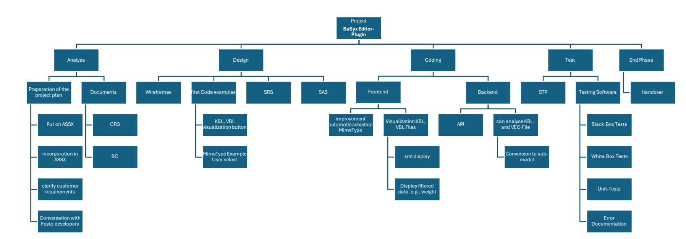
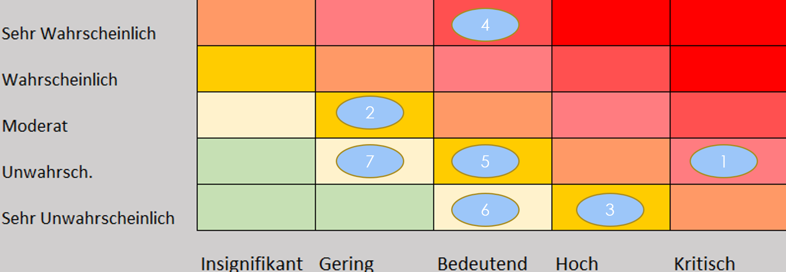

# Project Management Document

**Project:** BaSyx Editor Plugin Extension  
**Course:** Software Engineering  
**Class:** TINF24F  
**Professors:** Markus Rentschler, Pawel Wojcik  

---

## Version History

| Version | Date | Author | Comment |
|:--|:--|:--|:--|
| 0.1 | 21.10.2025 | Leonardo Risatti | Initial structure / Prototype |  
| 0.2 | 21.10.2025 | Leonardo Risatti | Added content |  
| 0.3 | 23.10.2025 | Leonardo Risatti | Small changes |  
| 1.0 | 19.11.2025 | Leonardo Risatti | Mojor Rework of Pm |

---

## 1. Project Assignment  

**Objective (Output)**  
The project extends the **Eclipse BaSyx UI** by developing an **Editor Plugin**, a **Viewer Plugin**, and enhancing the **REST API backend**.  
It allows importing, validating, and integrating external model files (KBL, VEC) into the **Asset Administration Shell (AAS)**, with automated plausibility checks, linking, data extraction, and visualization of structured XML data.  

**Benefit (Outcome)**  
- Reduce manual effort for integrating engineering data  
- Improve data quality and consistency  
- Enhance usability and interoperability within the BaSyx ecosystem  
- Enable structured XML visualization directly in AAS  

**Customer / Stakeholders**  
- **Customer:** Markus Rentschler, Pawel Wojcik  
- **Provider:** Team 3  

**Main Tasks**  
- Analysis  
- Design  
- Implementation  
- Testing  
- Documentation  

**Deadlines**  
- First presentation: 21.11.2025  
- Final presentation: TBD  

---
## 2. Project Organization  

| Role | Name |  
|---|---|  
| Project Director | Martin Böhm |  
| Project Manager | Florian Zahn |  
| Test Manager | Daniel Ziegler |  
| System Architect | Federico Dibenedetto / Felix Bandl |  
| Technical Documentation | Leonardo Risatti / Morten Haase |  

_All team members contribute to development._

## 3. Project Context  

**Initial Situation**  
The current BaSyx UI lacks direct integration of engineering data (KBL/VEC) into the AAS.  
Users must currently process and link such files manually.  
This project automates these steps, providing a more intelligent and user-friendly workflow.  

**Temporal Context**  
| Phase | Description |  
|---|---|  
| Pre-project | Familiarization with BaSyx, AAS, and model formats |  
| Project phase | Development of editor/viewer plugins and API |  
| Post-project | Handover and optional documentation updates |

**Social Context**  
| Stakeholder | Opportunity | Risk | Mitigation |  
|---|---|---|---|  
| Customer | Improved BaSyx usability | Late requirement changes | Regular feedback loops |  
| Team | Successful delivery | Resource overload | Clear task division |  
| User | Better visualization | Misunderstanding functions | Provide user manual and demos |

**Goals / Non-Goals**  
| Goals | Non-Goals |  
|---|---|  
| Integrate external model files into AAS | Redesign full BaSyx backend |  
| Automated extraction and linking of data | Replacement of existing BaSyx features |  
| REST API extension for XML access | Integration of unrelated data formats |  
| Structured XML visualization | Major UI redesign |

## 4. Work Breakdown Structure (PSP)

The project’s work is divided into major phases: Analysis, Design, Coding, Testing, and End Phase.  
During Analysis, requirements are clarified and documents such as CRS and BC are created.  
The Design phase includes wireframes, SRS, and SAS creation.  
Coding covers frontend and backend implementation, including the editor and viewer features, XML navigation, AAS generator, plausibility checks, and automated data extraction.  
Testing involves unit tests, black-box and white-box tests, as well as error documentation.  
The End Phase completes the project with the handover and presentation.  

---

## 5. Milestones  

| Milestone | Description | Planned Week |  
|---|---|---|  
| Requirement Clarification | Final clarification and sign-off of BC, CRS, and AAS integration | Week 6 |  
| Design Approval | Completion and acceptance of wireframes, SRS, SAS | Week 11 |  
| Code Implementation | All major functionalities implemented | Week 23 |  
| Testing & Error Documentation | All tests completed and errors documented | Week 36 |  
| Project Handover & Presentation | Delivery to stakeholders and first presentation on 21.11.2025; final presentation TBD | Week 37 |

---

## 6. Project Timeline 

As can be seen in the Gantt chart of the **Business Case (BC)**, the project is planned over a total of **37 working weeks**, distributed as follows:  
- **Analysis:** 6 weeks  
- **Design:** 5 weeks  
- **Coding / Implementation:** 12 weeks  
- **Testing:** 13 weeks  
- **End Phase / Handover:** 1 week  
---

## 7. Risks  

| # | Risk | Mitigation / Countermeasure |  
|---|---|---|  
| 1 | Dependencies change (e.g., BaSyx upstream) | Early detection, include time buffers, regular rebasing |  
| 2 | Migration / integration errors | Rollback strategy, backups, incremental integration |  
| 3 | Emerging security vulnerabilities | Code reviews, static analysis, alternative libraries if needed |  
| 4 | Team members unavailable | Redundant task distribution, knowledge documentation |  
| 5 | Schedule overrun | Early communication with stakeholders, reprioritization |  
| 6 | Backup failure | Decentralized backups (GitHub + local + cloud) |  
| 7 | Communication problems | Weekly meetings, asynchronous updates, clarify uncertainties |

The project team will actively monitor and manage these risks. Each risk is regularly reviewed, and mitigation strategies are applied throughout the project lifecycle. The **Risk Matrix** visually summarizes risk probability and impact.  

---

## 8. End of Project  
- Handover to stakeholders  
- First presentation on 21.11.2025; final presentation TBD  

