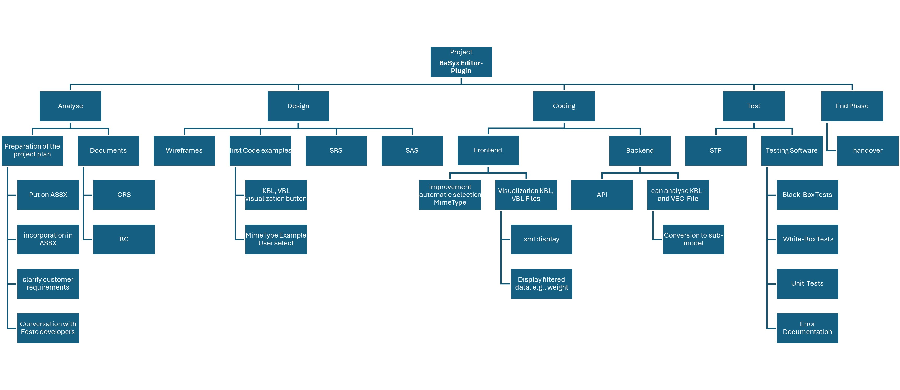
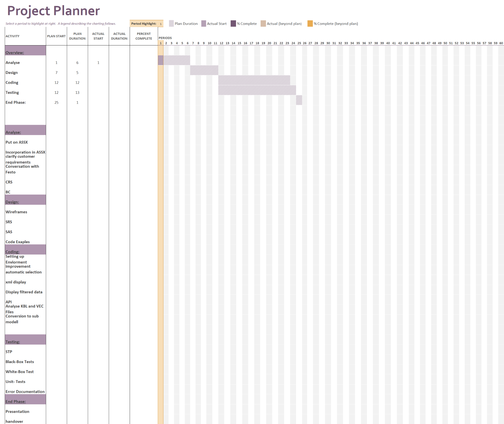

# Project Management Document

**Project:** BaSyx Editor Plugin Extension  
**Course:** Software Engineering  
**Class:** TINF24F 
**Professors:** Markus Rentschler, Pawel Wojcik  

---

## Version History

| Version | Date | Author | Comment |
|:--|:--|:--|:--|
| 0.1 | 21.10.2025 | Leonardo Risatti | Initial structure/Prototype |
| 0.2 | 21.10.2025 | Leonardo Risatti | Added content |
| 0.3 | 23.10.2025 | Leonardo Risatti | Small Changes |

---

## 1. Project Assignment

### Objective (Output)
The project extends the **Eclipse BaSyx user interface**, including the **Editor Plugin**, **Viewer Plugin**, and the **REST API backend**.  
It enables users to **import, validate, and integrate external model files** such as **KBL** or **VEC** into the **Asset Administration Shell (AAS)**.  
The system performs automated plausibility checks, linking, and data extraction into standardized submodels, and allows visualization of structured XML data through the Viewer Plugin.

### Benefit (Outcome)
- Reduces manual work when integrating engineering data  
- Improves data quality and consistency  
- Enhances usability and interoperability of the BaSyx ecosystem  
- Provides structured data visualization directly within the AAS environment  

### Customer / Stakeholders
- **Customer:** Markus Rentschler, Pawel Wojcik  
- **Provider:** Team 3  

### Main Tasks
- Analysis  
- Design  
- Implementation  
- Testing  
- Documentation  

### Deadlines
- Introductory lecture: 21.09.2025  
- End of project: *tbd*  
- Final presentation and project delivery: *tbd*  

---

## 2. Project Context

### Initial Situation
The current BaSyx UI lacks direct integration of engineering data (e.g., KBL/VEC files) into the AAS.  
Users must manually process and link such files.  
The project automates these steps and provides a more intelligent and user-friendly workflow within the BaSyx environment.

### Temporal Context
| Phase | Description |
|:--|:--|
| Pre-project | Familiarization with BaSyx and AAS concepts during lectures |
| Project phase | Development and integration of editor and viewer plugins |
| Post-project | tbd/optional |

### Social Context optional?
| Stakeholder | Chance | Risk | Action |
|:--|:--|:--|:--|
| Customer | Improved BaSyx usability | Change requests late in project | Regular feedback loops |
| Supplier | Successful delivery | Resource overload | Clear task division |
| User | Better AAS visualization | Misunderstanding of functions | Provide user manual and demos |

### Goals / Non-Goals
| Goals | Non-Goals |
|:--|:--|
| Integration of external model files into AAS | Redesign of the full BaSyx backend |
| Automated extraction and linking of technical data | Replacement of existing BaSyx features |
| REST API extension for XML data access | Integration of unrelated data formats |
| Visualization of structured XML data | Major UI redesign |

---

## 3. Project Organization

| Role | Name |
|:--|:--|
| Project Director | **Martin Böhm** |
| Project Manager | **Florian Zahn** |
| Test Manager | **Daniel Ziegler** |
| System Architect | **Federico Dibenedetto / Felix Bandl** |
| Technical Documentation | **Leonardo Risatti / Morten Haase** |

*All members contribute to development.*

---

## 4. Work Breakdown Structure (PSP)

---

## 5. Milestones

| Milestone | Planned Start | Duration (weeks) | Planned End |
|:--|:--|:--|:--|
| Project Setup & Analysis Start | Week 0 | 6 | Week 6 |
| Design Phase Start | Week 7 | 5 | Week 12 |
| Implementation (Coding) Start | Week 13 | 12 | Week 25 |
| Testing Phase Start | Week 26 | 13 | Week 39 |
| Final Phase & Presentation Preparation | Week 39 | 1 | Week 40 |

**Overview of Main Phases:**
- **Analysis:** Requirements, CRS, Business Case  
- **Design:** Wireframes, SRS, SAS, Code Examples  
- **Coding:** Environment setup, XML integration, API & submodel logic  
- **Testing:** Unit Tests, Black-Box / White-Box Tests, Error documentation  
- **End Phase:** Presentation & Handover

---

## 6. Gantt Chart

---

## 7. Risks

| Type | Description | Mitigation |
|:--|:--|:--|
| Technical | Complexity of AAS integration and REST API extension | Early familiarization and documentation of interfaces |
| Technical | Parsing errors with KBL/VEC file formats | Define clear validation rules and create fallback error handling |
| Planning | Tight deadlines and overlapping document submissions | Add time buffers and intermediate milestones |
| Personnel | Absences or reduced availability | Distribute tasks redundantly among team members |
| Communication | Misunderstandings between team and customer | Weekly sync meetings and GitHub issue tracking |
| Quality | Insufficient testing of new UI elements | Automated test coverage and manual test checklist |
| Dependencies | Changes in the upstream BaSyx repository | Monitor upstream commits and rebase regularly |
| Knowledge | Limited prior experience with BaSyx APIs | Internal workshops and shared technical notes |

---

## 8. Software and Hardware Requirements
*tbd* / optional

---

## 9. Communication and Reporting

### Within the Team
- Weekly sync meetings in person 
- Coordination via Microsoft Teams and GitHub Issues  
- Quick updates via WhatsApp  

### With the Customer 
- By Request

---

## 10. End of Project
*tbd* / optional

---

