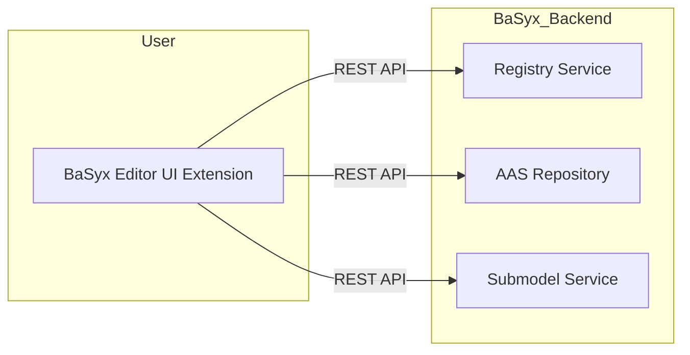
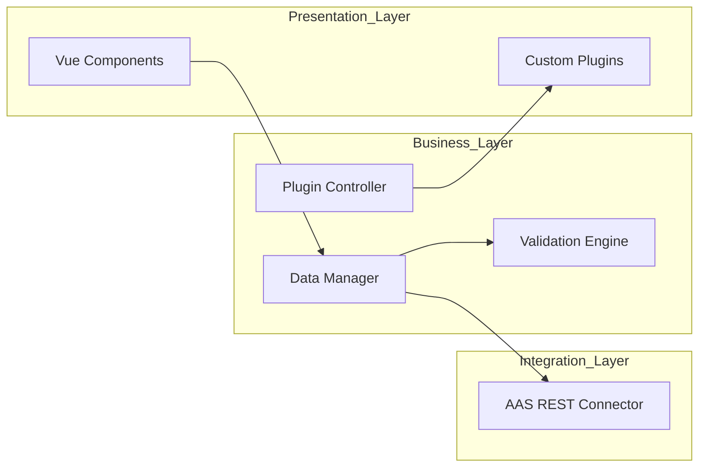

## Version Control

| Version | Date | Author | Comment |
|----------|------------|----------|----------------------------------|
| 1.0 | 29.10.2025 | Florian Zahn | Initialize a first draft of the SAS |
| 1.1 | 05.11.2025 | Florian Zahn | Added subsystem specifications (MOD01–MOD04) derived from SRS/CRS use cases.|
|1.2|Datum|Name|Kommentar2|
|1.3|Datum|Name|Kommentar3|

## Table of Contents
1. [Introduction](#intro)
2. [Scope](#scope)
3. [System Overview](#so)
   - 3.1 [System Environment](#sye)
   - 3.2 [Software Environment](#soe)
4. [Architecture](#ar)
   - 4.1 [Architectural Concept](#arc)
   - 4.2 [Architectural Model](#am)
5. [System Design](#sd)
6. [Product Interfaces](#pp)
   - 6.1 [User Interfaces](#ui)
   - 6.2 [Software Interfaces](#si)
   - 6.3 [Communication Interfaces](#ci)
7. [Subsystem Specification](#ss)

8. [Technical Concept](#tc)
   - 8.1 [Frontend Architecture](#fa)
   - 8.2 [Plugin Integration](#pi)
   - 8.3 [Data Validation & Synchronization](#dv)
   - 8.4 [Deployment Strategy](#ds)
   - 8.5 [Error Handling](#eh)
9. [References](#ref)

---

## 1 Introduction 

The purpose of this document is to describe the software architecture of the **BaSyx Editor Extension**, which builds upon the open-source **Eclipse BaSyx AAS Web UI**.  
This project aims to extend the existing Asset Administration Shell (AAS) visualization and management interface by adding advanced **editing**, **validation**, and **plugin management** functionalities.

Key quality attributes addressed: *extensibility*, *maintainability*, *interoperability*, and *usability*.

---

## 2 Scope 

The BaSyx Editor Extension enhances the capabilities of the BaSyx Web UI by enabling users to create, modify, and validate AAS models directly through the web interface.  
It also introduces a structured plugin system for specialized submodel visualization and editing components.  
The software integrates with existing BaSyx backend services, such as the **AAS Registry**, **AAS Repository**, and **Submodel Service**.

---

## 3 System Overview 

### 3.1 System Environment 
The system operates as a **web-based client application** interacting with BaSyx backend services.  
It communicates over HTTPS and uses the AAS REST API (V3).  
The following external components are required:
- BaSyx Registry Service
- BaSyx AAS Repository
- BaSyx Submodel Service

### 3.2 Software Environment 
- **Frontend**: Vue.js 3, TypeScript, Vite build system  
- **Backend (optional)**: Node.js-based proxy or BaSyx Java SDK V2  
- **Deployment**: Docker container or static web hosting  
- **Version Control**: Git / GitHub

---

## 4 Architecture 

### 4.1 Architectural Concept 

*Figure 4.1: High-level System Context Diagram*

The BaSyx Editor Extension acts as an **interactive frontend** that connects to the existing BaSyx backend ecosystem.  
It leverages BaSyx’s REST APIs to query, update, and validate AAS structures.

### 4.2 Architectural Model 

*Figure 4.2: Layered Architecture Diagram*

The architecture follows a **layered structure**, ensuring clear separation of concerns:
- Presentation Layer: UI, components, and plugins.
- Business Layer: Core logic, validation, and plugin management.
- Integration Layer: Communication with BaSyx REST services.

---

## 5 System Design 

The design includes modular Vue components, service classes, and a plugin interface.  
Below is a simplified class overview.

| Class Name | Description |
|-------------|--------------|
| `AasService` | Handles HTTP communication with BaSyx REST endpoints. |
| `ValidationEngine` | Performs schema and constraint validation on AAS data. |
| `PluginManager` | Loads and manages dynamically registered plugins. |
| `EditorComponent` | Main UI component for editing AAS/Submodels. |
| `SubmodelVisualizer` | Displays specific submodel types with custom components. |

---

## 6 Product Interfaces 

### 6.1 User Interfaces 
The user interacts via a browser-based graphical interface built with Vue.js.  
The UI provides forms, trees, and visual editors for AAS structures.

### 6.2 Software Interfaces 
- REST communication via Axios (HTTP client).  
- Plugin system exposed through a JavaScript interface (`IPlugin`).  
- Modules communicate using event emitters and reactive stores.

### 6.3 Communication Interfaces 
- Protocol: HTTPS  
- Format: JSON / AAS Metamodel V3 compliant  
- REST Endpoints:
  - `/registry/*`
  - `/submodels/*`
  - `/shells/*`

---

## 7 Subsystem Specification 

### 7.1 MOD01 – File Import and Validation Subsystem 

| Field | Description |
|:--|:--|
| **Subsystem ID** | MOD01 |
| **Related Use Cases** | UC01 |
| **Covered Requirements** | FR.01 (File Upload & Linking), FR.02 (KBL/VEC Data Extraction – pre-validation), NFR.01, NFR.05 |
| **Service** | Performs import of external model files (XML/KBL/VEC/AML). Executes file-content plausibility check and MimeType detection based on IANA registry. Stores validated files as `File` elements inside the AAS. |
| **Interfaces** | UI → REST endpoint `/upload`; AAS REST API `/shells/{id}/submodels/*` |
| **Postcondition** | Validated file is linked to AAS and available for further processing (UC03). |
| **Module Documentation** | [MOD01-File-Import](./MOD01-File-Import.md) |

---

### 7.2 MOD02 – XML Viewer and Navigation Subsystem 

| Field | Description |
|:--|:--|
| **Subsystem ID** | MOD02 |
| **Related Use Cases** | UC02 |
| **Covered Requirements** | FR.05 (Visualization of structured data), FR.03 (Table of Contents Visualization), NFR.01, NFR.02 |
| **Service** | Provides a Vue-based viewer component for visualizing XML data attached to AAS objects. Generates a navigable table of contents and renders node hierarchies based on DOM. |
| **Interfaces** | REST API endpoint `/files/{id}/content`; UI component `XMLViewer.vue` |
| **Postcondition** | User can navigate and inspect XML content in a structured tree view. |
| **Module Documentation** | [MOD02-XML-Viewer](./MOD02-XML-Viewer.md) |

---

### 7.3 MOD03 – AAS Generation and Submodel Mapping Subsystem 

| Field | Description |
|:--|:--|
| **Subsystem ID** | MOD03 |
| **Related Use Cases** | UC03 |
| **Covered Requirements** | FR.02 (KBL/VEC Extraction), FR.03 (Automated Population of Submodels), NFR.02, NFR.03 |
| **Service** | Implements wizard-driven generation of AAS from engineering files (KBL/VEC). Parses data, maps properties into “General Technical Data” submodel and other standardized submodels (e.g., Nameplate, Electrical Characteristics). |
| **Interfaces** | REST API endpoint `/aas/generate`; internal service `AasGenerationService` |
| **Postcondition** | AAS instance created with fully populated submodels and registered in BaSyx repository. |
| **Module Documentation** | [MOD03-AAS-Generation](./MOD03-AAS-Generation.md) |

---

### 7.4 MOD04 – Targeted Data Retrieval Subsystem 

| Field | Description |
|:--|:--|
| **Subsystem ID** | MOD04 |
| **Related Use Cases** | UC04 |
| **Covered Requirements** | FR.04 (REST API Extension for data retrieval), FR.06 (Error Handling), NFR.02 |
| **Service** | Provides backend API for querying specific entries inside stored XML/AAS data structures. Accepts a path or ID parameter and returns only the requested values as JSON. Implements error handling (400/404) and validation. |
| **Interfaces** | REST API endpoint `/api/query`; uses BaSyx AAS Repository Service |
| **Postcondition** | External systems receive accurate data points from the AAS without overhead. |
| **Module Documentation** | [MOD04-Data-Retrieval](./MOD04-Data-Retrieval.md) |

---

## 8 Technical Concept 

### 8.1 Frontend Architecture 
The frontend is built with Vue.js and Vite. It follows a modular structure using the Composition API.  
Components are grouped by feature and dynamically imported for performance.

### 8.2 Plugin Integration 
Plugins are registered by adding them to the `UserPlugins` directory.  
Each plugin implements the `IPlugin` interface to define entry points and hooks into the editor lifecycle.

### 8.3 Data Validation & Synchronization 
The validation engine ensures that any modified AAS structure adheres to the AAS Metamodel v3.  
Synchronization mechanisms guarantee data consistency between client and repository.

### 8.4 Deployment Strategy 
The application is deployed as a Docker container or static web application.  
Environment variables configure URLs of the BaSyx Registry and Repository services.

### 8.5 Error Handling 
Errors are handled via global interceptors and user notifications.  
Validation and network errors are displayed in the UI with context-specific messages.

---

## 9 References 
[1] Eclipse BaSyx AAS Web UI Repository – https://github.com/eclipse-basyx/basyx-aas-web-ui  
[2] AAS Metamodel Specification V3 – https://industrialdigitaltwin.org/  
[3] Vue.js Documentation – https://vuejs.org/  
[4] BaSyx Wiki – https://wiki.basyx.org/  
