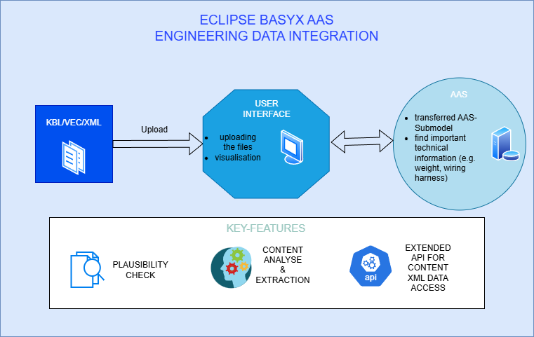
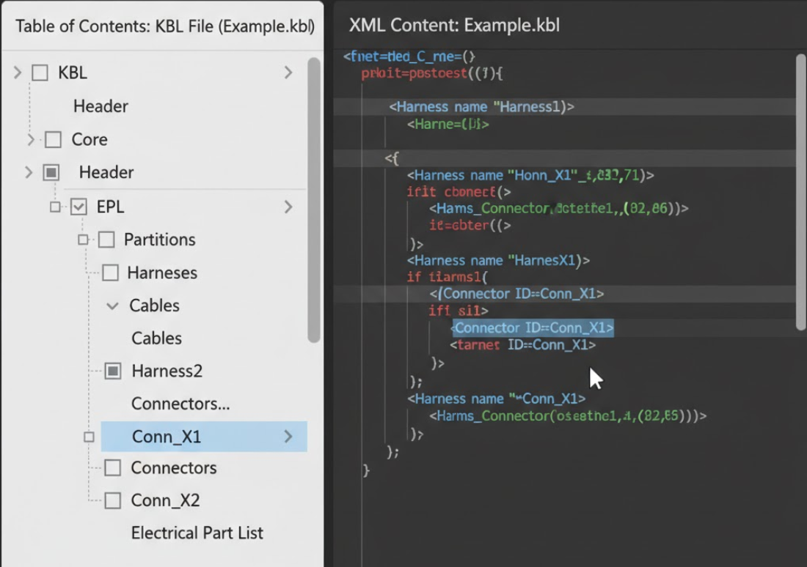
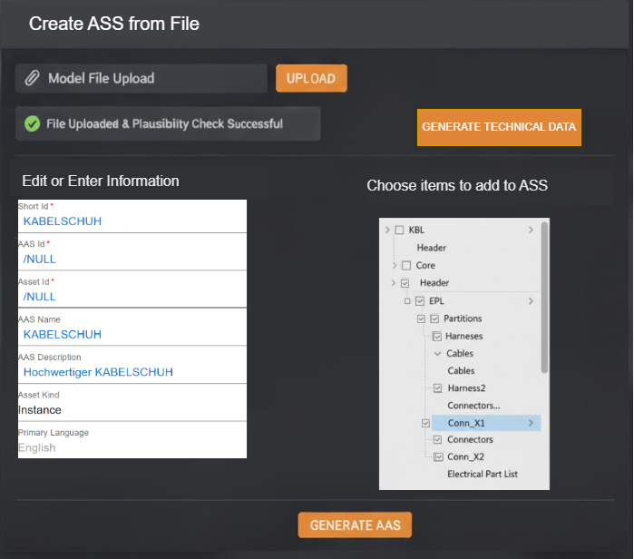
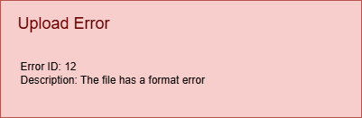

# Customer Requirement Specification (CRS)
## Team3-Basyx-Editor

## Version Control

|Version|Date|Author|Comment|
|-----|-----------|------------|---------------------|
|1.0|12.10.2025|Felix Bandl|first version|
|1.1|13.10.2025|Felix Bandl|priority added|
|1.2|31.10.2025|Felix Bandl|CRS adjusted after consultation with Mr. Rentschler|
|1.3|08.11.2025|Felix Bandl|added images, prioritized use cases, and fixed bugs|
|1.4|14.11.2025|Felix Bandl|improved format and a few bugs fixed|
|1.5|15.04.2026|Felix Bandl|add 2 FR after consultation with the developers and testers|
|1.6|17.04.25|Felix Bandl|UC 4 and FR feature request adapted|

## Table of contents
1. [Scope](#1-scope)
2. [Introduction](#2-introduction)
3. [Use Cases](#3-use-cases)
    - 3.1 [UC01: Import with plausibility check and MimeType detection](#31-uc01-import-with-plausibility-check-and-mimetype-detection)
    - 3.2 [UC02: XML viewer with navigation and display functions](#32-uc02-xml-viewer-with-navigation-and-display-functions)
    - 3.3 [UC03: AAS generator from KBL/VEC](#33-uc03-aas-generator-from-kblvec)
    - 3.4 [UC04: Automated extraction of specific XML entries from the AAS](#34-uc04-automated-extraction-of-specific-xml-entries-from-the-aas)
4. [Customer Requirements](#4-customer-requirements)
    - 4.1 [Functional Requirements](#41-functional-requirements)
        - 4.1.1 [FR.01 MimeType Detection of Model Files](#411-fr01-mimetype-detection-of-model-files)
        - 4.1.2 [FR.02 Plausibility Check (Extension vs. Content)](#412-fr02-plausibility-check-extension-vs-content)
        - 4.1.3 [FR.03 Readable Error Message After Plausibility Check](#413-fr03-readable-error-message-after-plausibility-check)
        - 4.1.4 [FR.04 Table of Contents in XML Visualization](#414-fr04-table-of-contents-in-xml-visualization)
        - 4.1.5 [FR.05 AAS Generator Wizard and Property Adoption](#415-fr05-aas-generator-wizard-and-property-adoption)
        - 4.1.6 [FR.06 Background Processing for KBL/VEC to AAS Submodels](#416-fr06-background-processing-for-kblvec-to-aas-submodels)
        - 4.1.7 [FR.07 REST API for Targeted Data Retrieval](#417-fr07-rest-api-for-targeted-data-retrieval)
    - 4.2 [Non-functional Requirements](#42-non-functional-requirements)
        - 4.2.1 [NFR.01 Usability](#421-nfr01-usability)
        - 4.2.2 [NFR.02 Performance](#422-nfr02-performance)
        - 4.2.3 [NFR.03 Maintainability and Contribution to the Open-Source Project](#423-nfr03-maintainability-and-contribution-to-the-open-source-project)
        - 4.2.4 [NFR.04 Documentation](#424-nfr04-documentation)
        - 4.2.5 [NFR.05 Compatibility](#425-nfr05-compatibility)
        - 4.2.6 [NFR.06 Error Handling](#426-nfr06-error-handling)
        - 4.2.7 [NFR.07 Availability (Demo)](#427-nfr07-availability-demo)
     

## List of Abbreviations

| Abbreviation | Meaning |
| :--- | :--- |
| AAS | Asset Administration Shell |
| API | Application Programming Interface |
| IANA | Internet Assigned Numbers Authority |
| REST | Representational State Transfer |
| UI | User Interface |
| VEC | Vehicle Electric Container [file format]|
| KBL | Cable Harness List [file format]|
| AML | Automation Markup Language [file format] |

## 1. Scope

This document explains the customer's problem and defines the essential project requirements and guidelines. It serves as a foundation and a common reference for all project stakeholders. A further focus is on defining the software requirements from a user and customer perspective, so that the development team understands the product vision and can translate it into tangible functions.

## 2. Introduction

 Figure 1: overview image

The central goal of this project is the functional extension of the Eclipse BaSyx user interface, particularly the editor and viewer plugins and the corresponding REST API backend. The extension is aimed at users who need a seamless and automated integration of existing engineering data, such as that available in KBL or VEC files, into the Asset Administration Shell (AAS).

At its core, the application should enable users to integrate external model files directly into the AAS. Instead of transferring data manually, the solution creates an efficient workflow in which the files are not only plausibility-checked and correctly linked, but also analyzed in terms of content. Essential information, such as technical data from wire harnesses, is automatically extracted and transferred to standardized submodels. This significantly reduces manual effort and increases data consistency.

Furthermore, the REST API will be extended to allow direct access to data points within attached XML files. This internal data can then be visualized in a structured and user-friendly way in the viewer. The customer benefit thus lies in the creation of a more powerful and intelligent user interface that makes it possible not only to manage complex data from external sources, but also to use and understand it directly in the context of the AAS.

## 3. Use Cases

The Use Cases are prioritized from 1 to 5 to indicate which requirements are most important to implement. 5 means very important and 1 means not so important.

### 3.1 UC01 Import with plausibility check and MimeType detection

| | |
| :--- | :--- |
| **Use Case ID** | UC01 |
| **Description** | The user wants to import an external model file with a specific format (KBL, VEC) or a general data format into the application. The application performs a plausibility check to ensure that the file extension and the actual content structure of the file match. After successful verification, the correct MimeType is set and the file is made available for further processing. |
| **Precondition** | The model file (e.g. KBL/VEC/XML/AML) exists on the user's local system. |
| **Postcondition on Success**| The file has been successfully validated. The correct MimeType has been determined and stored. The file is now available for subsequent processing steps (e.g., AAS generation). |
| **Triggering Event** | The user selects the file using an import function and starts the upload process. |
| **Involved roles** | User, BaSyx-UI, AAS-Server |
| **System boundary** | BaSyx-UI, AAS-Server |
| **Priority** | 5 | 

### 3.2 UC02 XML viewer with navigation and display functions

| | |
| :--- | :--- |
| **Use Case ID** | UC02 |
| **Description** | The user wants to view the contents of an XML file (e.g., imported KBL/VEC or AML data). The application provides an XML viewer that displays a table of contents for the XML document to facilitate navigation. The user can navigate to the appropriate section of the document using the table of contents.|
| **Precondition** | A valid XML file has already been successfully imported. |
| **Postcondition on Success**| The XML content is displayed clearly. Users can navigate to the relevant section of the XML file using the table of contents and view the details (including IDs) of the individual nodes. |
| **Triggering Event** | The user opens the viewer of an asset. |
| **Involved roles** | User,  BaSyx-UI (XML viewer component)|
| **System boundary** | BaSyx-UI |
| **Priority** | 4 | 

### 3.3 UC03 AAS generator from KBL/VEC

| | |
| :--- | :--- |
| **Use Case ID** | UC03 |
  | **Description** | The user wants to automatically generate an `Asset Administration Shell (AAS)` from prepared model files. The application provides a wizard that analyzes the KBL/VEC data and generates the AAS structure (submodels and submodel elements). All properties selected by the user in the wizard are transferred to the AAS. Generation is performed via the API of the AAS generator.  |
| **Precondition** | A valid model file (e.g., KBL file) is available. The connection to the AAS generator (REST API) is active. |
| **Postcondition on Success**| A new AAS has been successfully generated, in which all supported data selected by the user is mapped from the model file as submodel elements. The created AAS is stored on the AAS-Server. |
| **Triggering Event** | The user starts the AAS Generation Wizard and selects a model file. |
| **Involved roles** | User,  BaSyx-UI, AAS-Server|
| **System boundary** | BaSyx-UI, AAS-Server |
| **Priority** | 4 | 

### 3.4 UC04 Automated extraction of specific XML/JSON entries from external structured files

| | |
| :--- | :--- |
| **Use Case ID** | UC04 |
  | **Description** | An external system or internal backend service wants to retrieve only specific data points from an external structured file (XML or JSON) linked in the BaSyx context. The application provides a backend interface (REST API) to inspect the internal file structure (XML tree/JSON hierarchy), query specific elements by path/ID, and return only the requested values. The response format is always XML, independent of the source file format.  |
| **Precondition** | A valid external XML or JSON file is accessible via HTTP in the BaSyx-based environment. The requesting system provides a valid query point (path/ID/field). |
| **Postcondition on Success**| The backend interface returns only the requested data point(s) as XML to the requesting system, without transferring the complete source file. |
| **Triggering Event** | The external system/backend service sends an API request for structure inspection or targeted data retrieval, including the file reference and query point.|
| **Involved roles** | API Client, AAS-Server, BaSyx-UI|
| **System boundary** | BaSyx-UI, AAS-Server |
| **Priority** | 1 | 

## 4. Customer Requirements
The requirements are described with an ID and an overview to enable the development team to understand and implement them in the development process. 

### 4.1 Functional Requirements

The functional requirements are prioritized from 1 to 5 to indicate which requirements are most important to implement. 5 means very important and 1 means not so important.

#### 4.1.1 FR.01 MimeType Detection of Model Files

| Field | Content | 
| :--- | :--- | 
| **Requirement ID** | FR.01 | 
| **Overview** | The application must correctly identify all supported model file types (e.g., KBL, VEC, XML, AML) upon upload and automatically assign the corresponding IANA-compliant MimeType. | 
| **Fit Criterion** | Based on the file extension, the system recognizes the file type (e.g., KBL, VEC, XML, or AML). | 
| **Priority** | 5 | 

#### 4.1.2 FR.02 Plausibility Check (Extension vs. Content)

| Field | Content | 
| :--- | :--- | 
| **Requirement ID** | FR.02 | 
| **Overview** | Before further processing, the application must perform a plausibility check that verifies the file extension against the actual content (start line/structure) of the file for agreement. | 
| **Fit Criterion** | In case of a conflict between extension and content (e.g., an .xml file starting with PK), the upload is aborted, and an informative error message (see FR.03) is issued. | 
| **Priority** | 5 | 

#### 4.1.3 FR.03 Readable Error Message After Plausibility Check

| Field | Content |
| :--- | :--- |
| **Requirement ID** | FR.03 |
| **Overview** | If the plausibility check fails during file import, the application must display a readable and understandable error message to the user in the UI. |
| **Fit Criterion** | For each failed plausibility check, the UI shows a clear message that states the reason (e.g., extension/content mismatch) and indicates what the user can do next. |
| **Priority** | 5 |

#### 4.1.4 FR.04 Table of Contents in XML Visualization

| Field | Content | 
| :--- | :--- | 
| **Requirement ID** | FR.04 | 
| **Overview** | The Viewer plugin must display the data of an attached XML file in a structured table of contents to enable navigation through the document. | 
| **Fit Criterion** | When a user opens an AAS and clicks on the Viewer, a new view displays the table of contents and the XML file. | 
| **Priority** | 4 | 
| **UI** |   Figure 2: XML Viewer Sketch|

#### 4.1.5 FR.05 AAS Generator Wizard and Property Adoption

| Field | Content | 
| :--- | :--- | 
| **Requirement ID** | FR.05 | 
| **Overview** | The application must provide a Wizard that uses the data extracted from the KBL/VEC files for the automatic generation of the AAS model and the associated Submodel Elements. All properties selected by the user must be adopted. | 
| **Fit Criterion** | The Wizard guides the user through the generation process. Upon completion, the generated AAS model contains all selected KBL/VEC data as Submodel Elements. | 
| **Priority** | 4 | 
|**UI**| Figure 3: Generator Wizard|

#### 4.1.6 FR.06 Background Processing for KBL/VEC to AAS Submodels

| Field | Content |
| :--- | :--- |
| **Requirement ID** | FR.06 |
| **Overview** | As background processing of FR.05, the client application must automatically parse KBL/VEC files and transform the extracted data into the correct AAS submodels and submodel elements according to the defined mapping rules. Only the validated and correctly generated submodels are sent to the backend. |
| **Fit Criterion** | For a valid KBL/VEC input, client-side processing generates the expected submodels and correctly assigned submodel elements with accurate values and structure. The backend receives only valid submodels; invalid or incomplete mappings are not transmitted. |
| **Priority** | 4 |

#### 4.1.7 FR.07 REST API for Targeted Data Retrieval

| Field | Content | 
| :--- | :--- | 
| **Requirement ID** | FR.07 | 
| **Overview** | The backend interface (REST API) must be extended to allow external systems to inspect and query external structured files (XML/JSON) in a targeted way. The API must support structure inspection (XML tree/JSON hierarchy) and selective extraction of specific entries by path/ID/field. The response payload must always be returned as XML. (Reference to UC04). | 
| **Fit Criterion** | Endpoints for structure inspection and targeted querying exist. For a valid request, the API returns only the requested element(s)/value(s) as XML and does not return the full source document. For invalid query paths, the API returns a clear client error (e.g., HTTP 400/404). | 
| **Priority** | 1 | 

### 4.2 Non-functional Requirements

#### 4.2.1 NFR.01 Usability

| | |
| :--- | :--- |
| **Requirement ID** | NFR.01 |
| **Overview** | The new functionalities in the editor and viewer must be intuitive and well integrated into the existing workflow of the BaSyx-UI. |
| **Fit Criterion** | A user who is familiar with the BaSyx-UI can perform the main use cases (uploading a file, viewing XML content) without consulting the documentation. The workflow for each use case is clear and logical. |

#### 4.2.2 NFR.02 Performance

| | |
| :--- | :--- |
| **Requirement ID** | NFR.02 |
| **Overview** | The parsing of the files and the data extraction should be efficient to ensure a responsive user experience. |
| **Fit Criterion** | The server-side processing (parsing, extraction, populating the submodel) of a standard-sized model file must be completed in under 5 seconds. The UI provides feedback (e.g., a loading indicator) during this process. |

#### 4.2.3 NFR.03 Maintainability and Contribution to the Open-Source Project

| | |
| :--- | :--- |
| **Requirement ID** | NFR.03 |
| **Overview** | The developed code must comply with the coding standards of the Eclipse BaSyx project and be well documented to facilitate maintenance and future contributions from the open source community. |
| **Fit Criterion** | The code follows existing project conventions. All new public classes and methods are documented. The implementation is covered by unit tests. A pull request for the new features is created and submitted to the official BaSyx repositories. |

#### 4.2.4 NFR.04 Documentation

| | |
| :--- | :--- |
| **Requirement ID** | NFR.04 |
| **Overview** | Clear and structured user documentation for the new functionalities must be created. |
| **Fit Criterion** | An online user documentation is created. It explains the new functions with step-by-step instructions and screenshots. The tutorials for setting up the BaSyx infrastructure are evaluated and improved where gaps have been identified. |

#### 4.2.5 NFR.05 Compatibility

| | |
| :--- | :--- |
| **Requirement ID** | NFR.05 |
| **Overview** | The extensions must be fully compatible with the target version of the BaSyx-UI and the backend infrastructure and must not negatively affect existing functionalities. |
| **Fit Criterion** | All existing, unchanged functionalities of the BaSyx-UI continue to function as expected after the integration of the new features. The solution can be built and run within the standard BaSyx build chain. |

#### 4.2.6 NFR.06 Error Handling

| Field | Content | 
| :--- | :--- | 
| **Requirement ID** | NFR.06 | 
| **Overview** | The system must correctly handle errors (e.g., corrupt files, API failures, invalid query paths) and return clear, informative error messages (UI) or correct HTTP status codes (API). | 
| **Fit Criterion** | no crash occurs upon generation error (UC03); a 404 Not Found or 40 Bad Request is returned upon invalid API path (UC04). | 
|**UI**|  Figure 4: File Error Sketch|

#### 4.2.7 NFR.07 Availability (Demo)
| | |
| :--- | :--- |
| **Requirement ID** | NFR.07 |
| **Overview** | The final functionalities must be hosted on a publicly accessible demo server and be executable. |
| **Fit Criterion** | The Use Cases implemented in the project can be tested live by project stakeholders via a provided URL without requiring a VPN or special software installations.|
