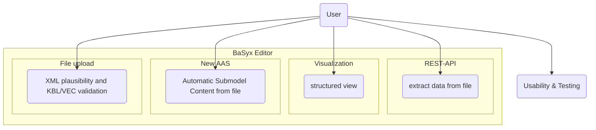

# Master Usecase 
## Team3-Basyx-Editor

## Version Control

|Version|Date|Author|Comment|
|-----|-----------|------------|---------------------|
|1.0|07.11.2025|Martin Boehm|first version|
|1.1|12.04.2026|Martin Boehm|spezifying requirements, new sources, update use case diagram|
|1.2|Datum|Name|Kommentar2|
|1.3|Datum|Name|Kommentar3|
|1.4|Datum|Name|Kommentar4|

## Table of contents
1. [Master Usecase](#1-master-usecase)
2. [Use Case Diagram](#2-use-case-diagram)
3. [Sources](#3-sources)

## 1. Master Usecase

As a BaSyx user, I want to work with XML, KBL, or VEC files in the AAS environment so that I can:
  + validate uploaded files for well-formedness and plausibility,
  + create a new AAS from KBL or VEC files and automatically extract relevant data into submodels,
  + view extracted submodels in a structured visualization with a table of contents, and
  + extract relevant file content externally via REST API.

## 2. Use Case Diagram

Abb 01 Use Case Diagram

## 3. Sources

* https://github.com/eclipse-basyx/basyx-aas-web-ui/issues/8
* https://dpp40.harting.com:3000/dpp?aas=https://dpp40.harting.com:8081/shells/aHR0cHM6Ly9kcHA0MC5oYXJ0aW5nLmNvbS9zaGVsbHMvMDkwMDAwMDUzNDA
* https://www.pulsion.co.uk/blog/requirements-analysis-for-software-development/
* https://www.softkraft.co/how-to-write-software-requirements/
* https://www.awork.com/glossary/user-requirements

