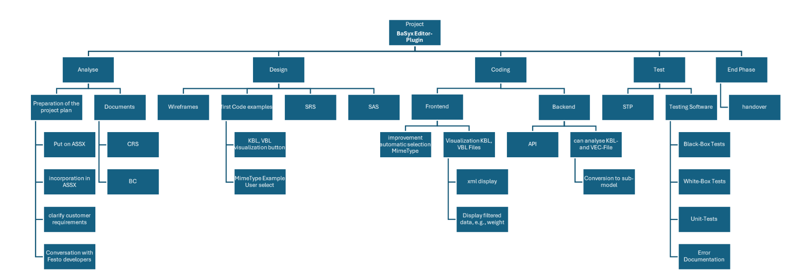
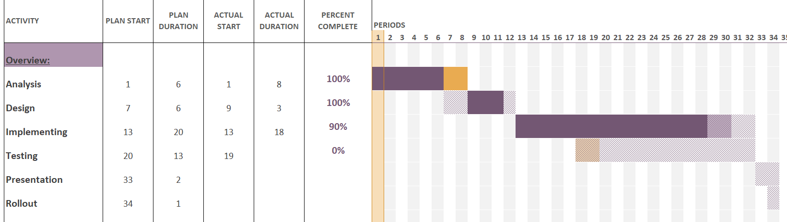
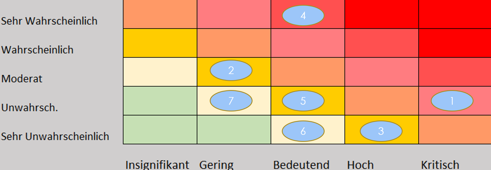

# Project Management Document

**Project:** BaSyx Editor Plugin Extension  
**Course:** Software Engineering  
**Class:** TINF24F  
**Professors:** Markus Rentschler, Pawel Wojcik  

## Version History

| Version | Date | Author | Comment |
|:--|:--|:--|:--|
| 0.1 | 21.10.2025 | Leonardo Risatti | Initial structure / Prototype |  
| 0.2 | 21.10.2025 | Leonardo Risatti | Added content |  
| 0.3 | 23.10.2025 | Leonardo Risatti | Small changes |  
| 1.0 | 19.11.2025 | Leonardo Risatti | Major Rework of Pm |

## 1. Project Assignment  

**Objective (Output)**  
The project extends the **Eclipse BaSyx UI** by developing an **Editor Plugin**, a **Viewer Plugin**, and enhancing the associated **REST API backend**.  
It enables the structured import, validation, and integration of external engineering model files (e.g., KBL and VEC) into the **Asset Administration Shell (AAS)**.  

The system provides automated plausibility checks, data extraction, and linking mechanisms, as well as a structured visualization of XML-based data within the BaSyx environment.  

Additionally, this document establishes a common understanding of the system scope and serves as a foundation for development, testing, and validation throughout the project lifecycle.  

**Stakeholders**  
- **Customer:** Markus Rentschler, Pawel Wojcik  
- **Users:** Developers and engineers working with AAS and engineering data  
- **Project Team:** Team 3  

**Main Tasks**  
- Requirements analysis and specification (Use Cases, functional & non-functional requirements)  
- System design (architecture, interfaces, data flow)  
- Implementation of editor and viewer plugins as well as backend extensions  
- Testing and validation of all system components  
- Documentation

**Benefit (Outcome)**  
- Reduction of manual effort when integrating  data  
- Improved data quality and consistency through automated validation  
- Enhanced usability and transparency within the BaSyx ecosystem  
- Structured and user-friendly visualization of complex XML data  
- Clear basis for implementation and verification via defined requirements 

**Deadlines**  
- First presentation: 21.11.2025  
- Handover to stakeholders: 21.05.2026  
- Final presentation: 22.05.2026  
---
## 2. Project Organization  

| Role | Name |  
|---|---|  
| Project Director | Martin Böhm |  
| Project Manager | Florian Zahn |  
| Test Manager | Daniel Ziegler |  
| System Architect | Federico Dibenedetto / Felix Bandl |  
| Technical Documentation | Leonardo Risatti / Morten Haase |  

_All team members contribute to development._

## 3. Project Context  

This section describes the context in which the project is carried out. It outlines the organizational, technical, and temporal framework conditions as well as the involved stakeholders.  

**Temporal Context**  
| Phase | Description |  
|---|---|  
| Pre-project | Familiarization with BaSyx architecture, AAS concepts, repository structure, and model formats (KBL/VEC) |  
| Project phase | Iterative development of editor and viewer plugins, REST API extensions, and integration into the existing BaSyx system |  
| Post-project | Handover to stakeholders, documentation finalization, and potential future extensions |  

**Social Context**  
| Stakeholder | Role | Opportunity | Risk | Mitigation |  
|---|---|---|---|---|  
| Customer  | Define requirements, evaluate results | Improved teaching and demonstrability of BaSyx extensions | Changing or unclear requirements | Regular reviews and feedback sessions |  
| Users  | Use the system for data integration and analysis | More efficient workflows and better data understanding | Misinterpretation of features or workflows | User documentation, examples, and demos |  
| Project Team | Design and implement the solution | Successful project delivery and technical learning | Overload, knowledge gaps | Clear task distribution, internal communication, documentation |  
| Open-Source Community  | Potential future users / contributors | Reusable extension for broader ecosystem | Compatibility issues with upstream changes | Modular design, alignment with BaSyx standards |  

**Goals / Non-Goals**  

| Goals | Non-Goals |  
|---|---|  
| Seamless integration of external model files (KBL, VEC) into AAS | Redesign of the complete BaSyx backend architecture |  
| Automated validation, extraction, and linking of engineering data | Replacement of existing BaSyx core functionalities |  
| Extension of REST API for structured XML data access | Support for arbitrary or unrelated data formats |  
| Visualization of XML data in a structured and user-friendly way | Full UI redesign beyond plugin scope |  
| Integration into existing plugin-based BaSyx architecture | Development of a standalone system outside BaSyx |  

## 4. Project Structure Plan(PSP)

The **Project Structure Plan (PSP)** organizes the project into five main phases: **Analysis, Design, Coding, Testing, and End Phase**, each consisting of clearly defined sub-tasks.

During the **Analysis phase**, the project plan is prepared and fundamental requirements are clarified. This includes the integration into ASSX, requirement discussions with stakeholders, and alignment with external partners. In parallel, essential project documents such as the CRS (Customer Requirements Specification) and Business Case (BC) are created.

The **Design phase** focuses on defining the system structure and user interaction. This includes the creation of wireframes, initial code examples, and technical specifications such as the Software Requirements Specification (SRS) and Software Architecture Specification (SAS).

In the **Coding phase**, the defined system functionalities are implemented based on the previously specified requirements and use cases.  
The focus lies on translating the designed concepts into a working software solution within the existing BaSyx architecture.  

The **Testing phase** ensures system quality through structured validation. This includes the development of a Software Test Plan (STP), execution of black-box, white-box, and unit tests, as well as systematic error documentation.

Finally, the **End Phase** concludes the project with the formal handover to stakeholders, ensuring that all deliverables, documentation, and results are completed and ready for presentation.

## 5. Milestones  
This section defines the Milestones based on the PSP.
| Milestone | Description | Planned Week |  
|---|---|---|  
| Requirement Clarification BC | Final clarification and sign-off of BC, CRS, and AAS integration |  6 |  
| Design Approval | Completion and acceptance of wireframes, SRS, SAS |  12 |  
| Code Implementation | All major functionalities implemented | 32 |  
| Testing & Error Documentation | All tests completed and errors documented | 32 |  
| Project Handover & Presentation | Delivery to stakeholders and presentation | 34 |

## 6. Project Timeline 

As can be seen in the Gantt chart of the **Business Case (BC)**, the project is planned over a total of **37 working weeks**, distributed as follows:  
- **Analysis:** 6 weeks  
- **Design:** 6 weeks  
- **Implementation:** 20 weeks  
- **Testing:** 13 weeks  
- **End Phase:** 3 week  

## 7. Risks  

This section identifies potential risks that may affect the successful execution of the project.  
For each risk, possible impacts are considered and appropriate mitigation strategies are defined.  

| # | Risk | Mitigation / Countermeasure |  
|---|---|---|  
| 1 | Dependencies change (e.g., BaSyx upstream) | Early detection, include time buffers, regular rebasing |  
| 2 | Migration / integration errors | Rollback strategy, backups, incremental integration |  
| 3 | Emerging security vulnerabilities | Code reviews, static analysis, alternative libraries if needed |  
| 4 | Team members unavailable | Redundant task distribution, knowledge documentation |  
| 5 | Schedule overrun | Early communication with stakeholders, reprioritization |  
| 6 | Backup failure | Decentralized backups (GitHub + local + cloud) |  
| 7 | Communication problems | Weekly meetings, asynchronous updates, clarify uncertainties |

The project team will actively monitor and manage these risks. Each risk is regularly reviewed, and mitigation strategies are applied throughout the project lifecycle. The **Risk Matrix** visually summarizes risk probability and impact.  

