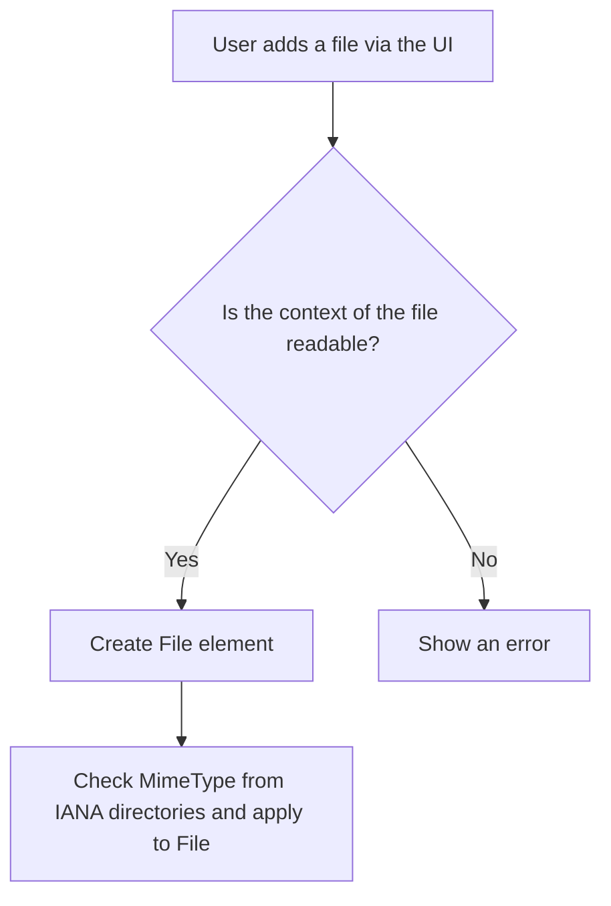
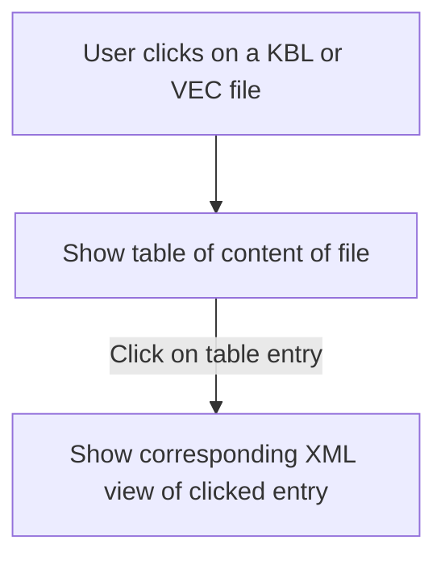
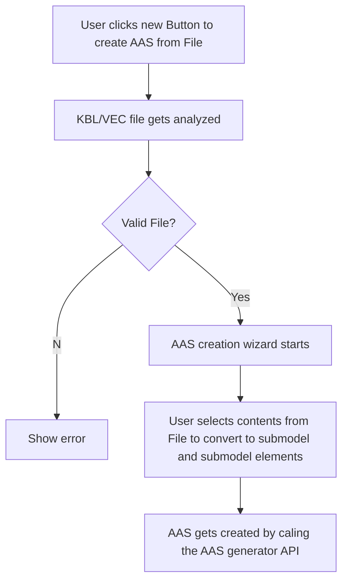
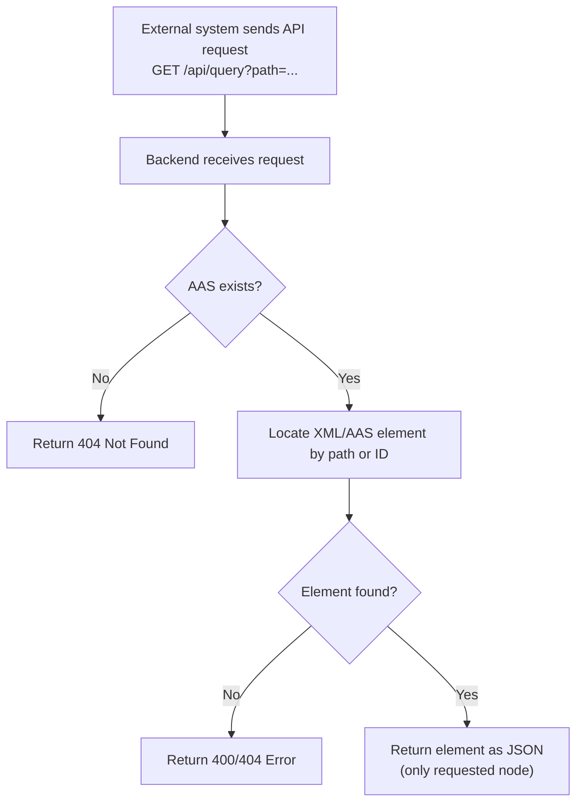

# Software Requirements Specification
## Team3-Basyx-Editor

## Version Control

|Version|Date|Author|Comment|
|-----|-----------|------------|---------------------|
|1.0|23.10.25|Federico Dibenedetto|Initial creation|
|1.1|30.10.25|Federico Dibenedetto|Changed UC1 based off of weekly findings and updated flowcharts to use mermaid|
|1.2|11.11.25|Federico Dibenedetto|Changed Use Cases based off of meeting with Mr. Rentschler|
|1.3|13.11.25|Federico Dibenedetto|Added Glossary, Component overview and little fixes|
|1.4|Date|Name|Comment4|

## Table of contents
1. [Glossary](#1-glossary)
2. [Scope](#2-scope)
3. [Introduction](#3-introduction)
4. [Component Overview](#4-component-overview)
5. [Use Cases](#5-use-cases)
  - 5.1 [UC01: Import with plausibility check and MimeType detection](#51-uc01-import-with-plausibility-check-and-mimetype-detection)
  - 5.2 [UC02: XML viewer with navigation and display functions](#52-uc02-xml-viewer-with-navigation-and-display-functions)
  - 5.3 [UC03: AAS generator from KBL/VEC](#53-uc03-aas-generator-from-kblvec)
  - 5.4 [UC04: Automated extraction of specific XML entries from the AAS](#54-uc04-automated-extraction-of-specific-xml-entries-from-the-aas)
6. [Customer Requirements](#6-customer-requirements)
    - 6.1 [Functional Requirements](#61-functional-requirements)
    - 6.1.1 [FR.01 File Upload and Linking](#611-fr01-file-upload-and-linking)
    - 6.1.2 [FR.02 KBL/VEC Data Extraction](#612-fr02-kblvec-data-extraction)
    - 6.1.3 [FR.03 Automated Population of Submodels](#613-fr03-automated-population-of-submodels)
    - 6.1.4 [FR.04 REST API Extension](#614-fr04-rest-api-extension)
    - 6.1.5 [FR.05 Visualization of structured data](#615-fr05-visualization-of-structured-data)
    - 6.1.6 [FR.06 Error Handling](#616-fr06-error-handling)
    - 6.2 [Non-functional Requirements](#62-non-functional-requirements)
    - 6.2.1 [NFR.01 Usability](#621-nfr01-usability)
    - 6.2.2 [NFR.02 Performance](#622-nfr02-performance)
    - 6.2.3 [NFR.03 Maintainability and Contribution to the Open-Source Project](#623-nfr03-maintainability-and-contribution-to-the-open-source-project)
    - 6.2.4 [NFR.04 Documentation](#624-nfr04-documentation)
    - 6.2.5 [NFR.05 Compatibility](#625-nfr05-compatibility)


## 1. Glossary

| Term | Definition |
|------|------------|
| AAS | Asset Administration Shell – standardized digital representation of an asset. |
| Submodel | Structured data container inside an AAS. |
| KBL | XML-based format for cable harness data exchange. |
| VEC | Vehicle Electric Container – XML standard for electric/electronic system data. |
| MimeType | Internet media type describing file content type (e.g., `application/xml`). |
| DOM | Document Object Model – tree representation of XML. |
| REST API | HTTP-based programming interface used for structured data access. |
| BaSyx | Eclipse open-source framework for managing and hosting AAS. |
| Node ID | Identifier for an XML element or AAS element used for referencing. |

## 2. Scope

This Software Requirements Specification (SRS) defines the Use-Cases for extending the Eclipse BaSyx user interface, including the editor and viewer plugins as well as the related REST API backend. In addition functional and non-functional requirements will be listed. It establishes a common understanding among stakeholders and provides the basis for development, testing, and validation of the software solution.

The goal of the system is to enable seamless and automated integration of engineering data from external sources (e.g., KBL or VEC files) into the Asset Administration Shell (AAS). The specification focuses on translating user and business needs into clear, implementable software requirements.

## 3. Introduction

The project aims to extend Eclipse BaSyx to support direct import, validation, and integration of external model files into the AAS. The system will automate data plausibility checks, linking, and extraction of relevant technical information into standardized submodels. This reduces manual work and improves data quality and consistency.

Additionally, the REST API will be enhanced to provide access to data points within XML-based files, allowing this information to be visualized in a structured and user-friendly manner in the viewer. The resulting system will deliver an efficient and intelligent interface for managing and understanding complex engineering data within the AAS environment.

### 4 Component Overview

**Frontend (BaSyx UI):**
- File Upload Component
- MIME Type Detection & Plausibility Check (Updated)
- XML Viewer (Tree-Based Navigation) (New)
- AAS Generator Wizard (New)
- Error Message Handling System  

**Backend (AAS Server Extensions):**
- KBL/VEC Data Extraction Service (New)  
- XML Query REST API Endpoint (New)  

## 5. Use Cases

### 5.1 UC01 Import with plausibility check and MimeType detection

| | |
| :--- | :--- |
| **Use Case ID** | UC01 |
| **Description** | The user wants to import an external model file with a specific format (KBL, VEC) or a general data format into the application. The application performs a plausibility check to ensure that the file extension and the actual content structure of the file match. After successful verification, the correct MimeType is set and the file is made available for further processing. |
| **Involved Roles** | User, BaSyx-UI (Editor-Plugin), AAS-Server |
| **System Boundary** | BaSyx-UI, AAS-Server |
| **Precondition** | The user is in the BaSyx UI editor and has an AAS open for editing. The model file exists on the user's local system. |
| **Postcondition on Success**| The file has been successfully validated. The correct MimeType has been determined and stored. The file is now available for subsequent processing steps (e.g., AAS generation). |
| **Triggering Event** | The user selects the file using an import function and starts the upload process. |

## Flowchart UC01


SRS-UC01-Graph

### 5.2 UC02 XML viewer with navigation and display functions

| | |
| :--- | :--- |
| **Use Case ID** | UC02 |
| **Description** | The user wants to view the contents of an XML file (e.g., imported KBL/VEC or AML data). The application provides an XML viewer that displays a table of contents for the XML document to facilitate navigation. The user can navigate to the appropriate section of the document using the table of contents. |
| **Involved Roles** | User, BaSyx-UI (XML viewer component) |
| **System Boundary** | BaSyx-UI, AAS-Server |
| **Precondition** | A valid XML file has already been successfully imported. |
| **Postcondition on Success**| The XML content is displayed clearly. Users can navigate to the relevant section of the XML file using the table of contents and view the details (including IDs) of the individual nodes. |
| **Triggering Event** | The user opens the viewer of an asset. |

## Flowchart UC02


SRS-UC02-Graph

### 5.3 UC03 AAS generator from KBL/VEC

| | |
| :--- | :--- |
| **Use Case ID** | UC03 |
| **Description** | The user wants to automatically generate an Asset Administration Shell (AAS) from prepared model files. The application provides a wizard that analyzes the KBL/VEC data and generates the AAS structure (submodels and submodel elements). All properties selected by the user in the wizard are transferred to the AAS. Generation is performed via the API of the AAS generator. |
| **Involved Roles** | User, BaSyx-UI (XML viewer component), AAS-Server |
| **System Boundary** | BaSyx-UI, AAS-Server |
| **Precondition** | A valid model file (e.g., KBL file) is available. The connection to the AAS generator (REST API) is active. |
| **Postcondition on Success**| A new AAS has been successfully generated, in which all supported data selected by the user is mapped from the model file as submodel elements. The created AAS is stored on the AAS-Server. |
| **Triggering Event** | The user selects or expands the linked XML file element in the viewer. |

## Flowchart UC03


SRS-UC03-Graph

### Example AAS Structure After Generation

```
AAS
 └── Submodel: GeneralTechnicalData
      ├── Weight
      ├── Dimensions
      ├── CableInfo
      └── ManufacturerData
```

### 5.4 UC04 Automated extraction of specific XML entries from the AAS

| | |
| :--- | :--- |
| **Use Case ID** | UC04 |
| **Description** | An external system or internal backend service wants to retrieve specific, individual XML entries from the AAS model previously generated by UC03. The application provides a backend interface (REST API) that enables targeted data queries by transmitting a specific query point (e.g., the ID of an element or a path in the XML/AAS model). The interface then returns only the desired information (e.g., the value of a specific property). |
| **Involved Roles** | BaSyx-UI (Editor-Plugin), AAS-Server |
| **System Boundary** | BaSyx-UI, AAS-Server |
| **Precondition** | An AAS model was successfully generated by UC03 and is available on the AAS-Server. The requesting system knows the ID or path of the desired XML/AAS entry. |
| **Postcondition on Success**| The backend interface automatically and accurately returns the requested specific XML/AAS information to the requesting system. |
| **Triggering Event** | The external system/backend service sends an API request to the interface containing the desired query point (path/ID). |

## Flowchart UC04


SRS-UC04-Graph

```
{
  "path": "/Harness/Connector[5]/Terminal[2]/ID",
  "value": "ABC-4711",
  "type": "string"
}
```

## 6. Customer Requirements
The requirements are described with an ID and an overview to enable the development team to understand and implement them in the development process.

### 6.1 Functional Requirements

#### 6.1.1 FR.01 File Upload and Linking

| | |
| :--- | :--- |
| **Requirement ID** | FR.001 |
| **Overview** | The application must provide a UI component that allows users to upload external model files. After a successful upload, the file must be linked as a `File` element in the AAS and the correct `mimeType` must be set automatically. |
| **Acceptance Criterion** | A user can select a local file via the UI. The file is uploaded and appears in the AAS structure. The `mimeType` property corresponds to the actual file type. The process handles common file types correctly. |

#### 6.1.2 FR.02 KBL/VEC Data Extraction

| | |
| :--- | :--- |
| **Requirement ID** | FR.002 |
| **Overview** | The application must be able to parse uploaded KBL and VEC files to extract predefined information, including nameplate data and important technical specifications (e.g., weight, features). |
| **Acceptance Criterion** | When a valid KBL or VEC file is entered, the application correctly extracts the specified data points. The extracted data can be compared with the source file. The process must be able to handle the defined file schemas. |

#### 6.1.3 FR.03 Automated Population of Submodels

| | |
| :--- | :--- |
| **Requirement ID** | FR.003 |
| **Overview** | The data extracted from the KBL/VEC files must be automatically used to create or update the "General Technical Data" AAS submodel after pressing the "Generate Technical Data" button. |
| **Acceptance Criterion** | After a KBL/VEC file has been processed, the corresponding AAS contains a "General Technical Data" submodel whose elements (e.g., Weight, Dimensions) are filled with the values from the file. |

#### 6.1.4 FR.04 REST API Extension

| | |
| :--- | :--- |
| **Requirement ID** | FR.004 |
| **Overview** | The BaSyx REST API must be extended to provide a mechanism for accessing and retrieving structured data from an XML file stored as a `File` element in an AAS. |
| **Acceptance Criterion** | A new API endpoint exists according to the specification in the corresponding GitHub issue. When called with the correct path to an XML file within an AAS, the API returns the file content in a structured format (e.g., JSON). The endpoint can be verified by automated tests. |

#### 6.1.5 FR.05 Visualization of structured data

| | |
| :--- | :--- |
| **Requirement ID** | FR.005 |
| **Overview** | The viewer plugin must be able to display the internal data points of an attached XML file in a structured, hierarchical view. |
| **Acceptance Criterion** | When a user clicks on a linked XML file in the viewer, a new panel or a new view displays the content of the XML file as a tree structure (similar to Notepad++). The displayed structure correctly reflects the Document Object Model (DOM) of the XML file. |

#### 6.1.6 FR.06 Error Handling

| | |
| :--- | :--- |
| **Requirement ID** | FR.006 |
| **Overview** | The system must handle errors, such as uploading faulty or un-processable files, properly. |
| **Acceptance Criterion** | If an attempt is made to process an invalid KBL/VEC file, the application must not crash. It must issue a clear and informative error message to the user explaining the error. API errors must return appropriate HTTP status codes. |

### 6.2 Non-functional Requirements

#### 6.2.1 NFR.01 Usability

| | |
| :--- | :--- |
| **Requirement ID** | NFR.001 |
| **Overview** | The new functionalities in the editor and viewer must be intuitive and well integrated into the existing workflow of the BaSyx UI. |
| **Acceptance Criterion** | A user who is familiar with the BaSyx UI can perform the main use cases (uploading a file, viewing XML content) without consulting the documentation. The workflow for each use case is clear and logical. |

#### 6.2.2 NFR.02 Performance

| | |
| :--- | :--- |
| **Requirement ID** | NFR.002 |
| **Overview** | The parsing of the files and the data extraction should be efficient to ensure a responsive user experience. |
| **Acceptance Criterion** | The server-side processing (parsing, extraction, populating the submodel) of a standard-sized model file (up to 5 MB) must be completed in under 5 seconds. The UI provides feedback (e.g., a loading indicator) during this process. |

#### 6.2.3 NFR.03 Maintainability and Contribution to the Open-Source Project

| | |
| :--- | :--- |
| **Requirement ID** | NFR.003 |
| **Overview** | The developed code must comply with the coding standards of the Eclipse BaSyx project and be well documented to facilitate maintenance and future contributions from the open source community. |
| **Acceptance Criterion** | The code follows existing project conventions. All new public classes and methods are documented. The implementation is covered by unit tests. A pull request for the new features is created and submitted to the official BaSyx repositories. |

#### 6.2.4 NFR.04 Documentation

| | |
| :--- | :--- |
| **Requirement ID** | NFR.004 |
| **Overview** | Clear and structured user documentation for the new functionalities must be created. |
| **Acceptance Criterion** | An online user documentation is created. It explains the new functions with step-by-step instructions and screenshots. The tutorials for setting up the BaSyx infrastructure are evaluated and improved where gaps have been identified. |

#### 6.2.5 NFR.05 Compatibility

| | |
| :--- | :--- |
| **Requirement ID** | NFR.005 |
| **Overview** | The extensions must be fully compatible with the target version of the BaSyx UI and the backend infrastructure and must not negatively affect existing functionalities. |

| **Acceptance Criterion** | All existing, unchanged functionalities of the BaSyx UI continue to function as expected after the integration of the new features. The solution can be built and run within the standard BaSyx build chain. |
