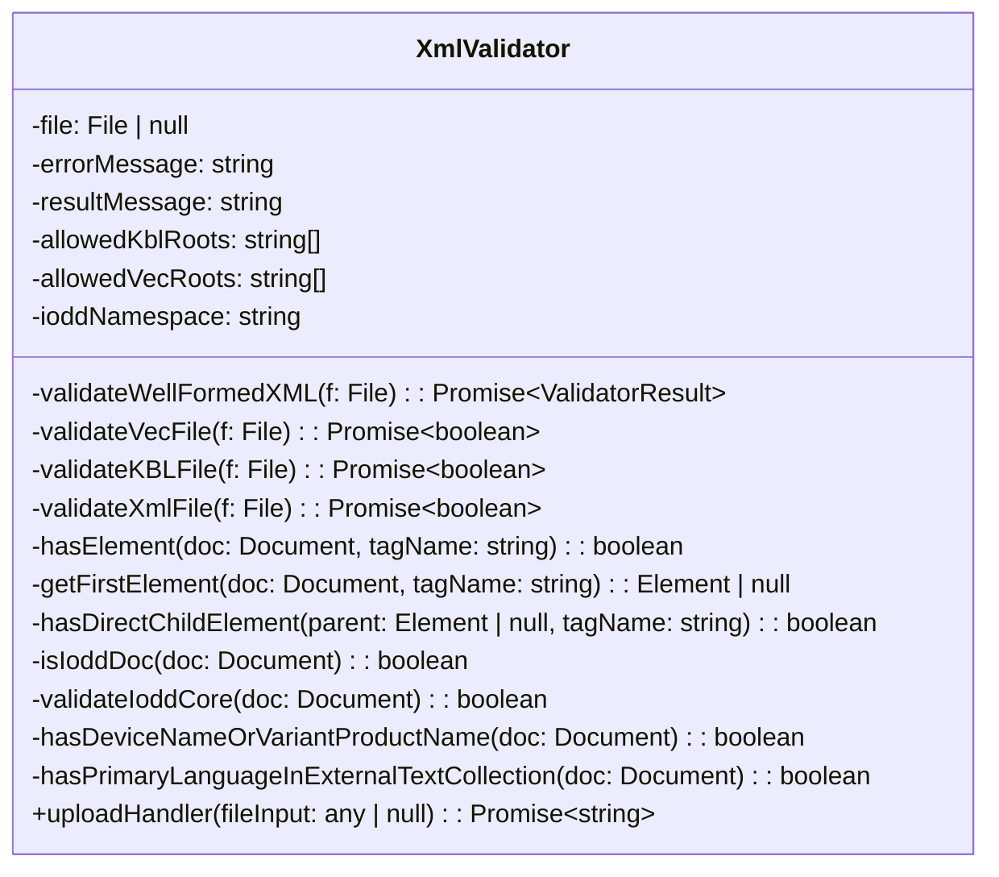
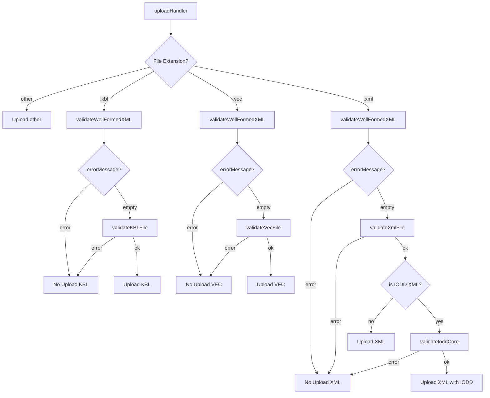

# XML / KBL / VEC Validator

### Programmer: Martin Böhm

## Upload Handler

- checks XML-plausibility if file ends with .VEC, .KBL, .XML
- checks separate root elements for .KBL, .VEC
- checks IODD plausibilty, if .XML-file is IODD-file

### Source Code

- ./aas-web-ui/src/utils/XmlValidator.ts

### Class Diagram Xml Validator

## Flowchart XmlValidator

## MimeType Expansion for KBL/VEC

MIME type settings were expanded to include media types with pending IANA registration requests (as of April 2026).

### Source Code:

- .\aas-web-ui\src\composables\AAS\SubmodelElements\File.ts
- .\aas-web-ui\src\components\EditorComponents\InputTypes\FileInput.vue
