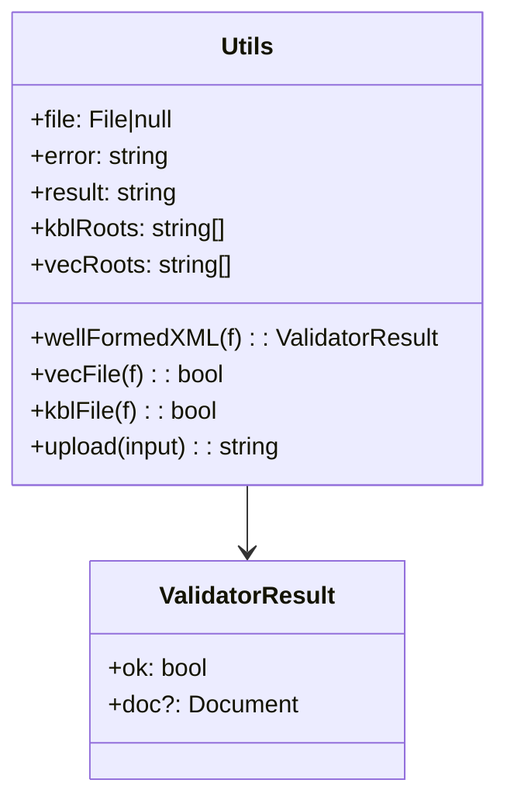
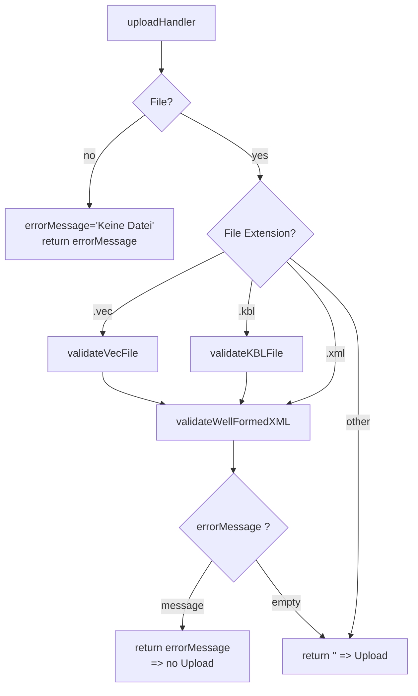

# XML / KBL / VEC Validator
###     ./aas-web-ui/src/utils/XmlValidator.ts

## Class Diagram Xml Validator

```mermaid
classDiagram
%%{init: {'classDiagram': {'nodeSpacing': 100}}}%%
    class ValidatorResult {
        +ok: bool
        +doc?: Document
    }

    class Utils {
        +file: File|null
        +error: string
        +result: string
        +kblRoots: string[]
        +vecRoots: string[]
        
        +wellFormedXML(f): ValidatorResult
        +vecFile(f): bool
        +kblFile(f): bool
        +upload(input): string
    }
    
    Utils --> ValidatorResult
```

## Flowchart XmlValidator

```mermaid
flowchart TD
    A[uploadHandler] --> B{File?}
    B -->|no| C[errorMessage='Keine Datei'<br/>return errorMessage]
    B -->|yes| D{File Extension?}
    D -->|.vec| E[validateVecFile]
    D -->|.kbl| F[validateKBLFile]
    D -->|.xml| G[validateWellFormedXML]
    D -->|other| K
    E --> G
    F --> G
    G --> I{errorMessage ?}
    I -->|message| J[return errorMessage <br>=> no Upload]
    I -->|empty| K[return '' => Upload]
```
