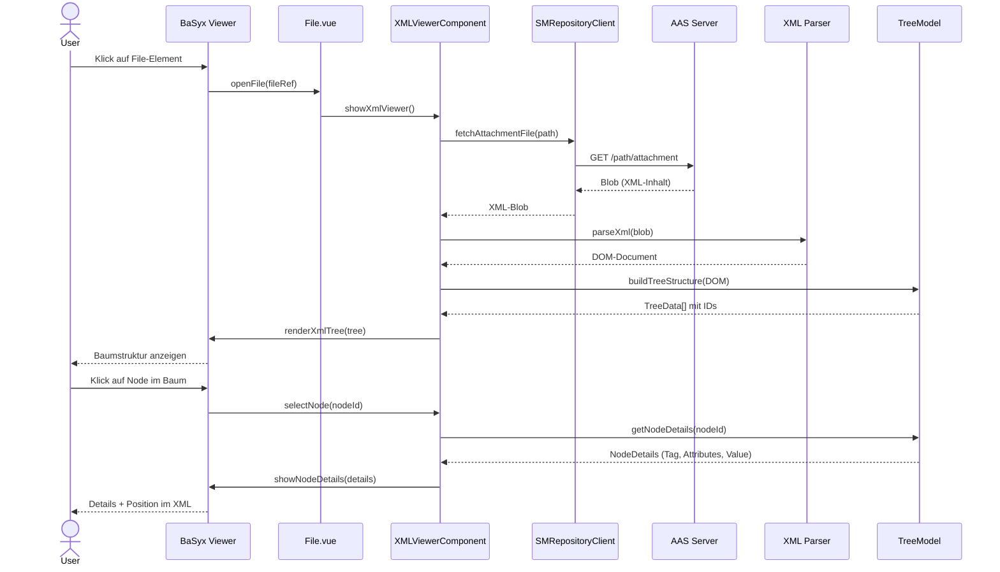

```mermaid
sequenceDiagram
    actor User
    participant UI as BaSyx Viewer
    participant FileComponent as File.vue
    participant XMLViewer as XMLViewerComponent
    participant SMRepository as SMRepositoryClient
    participant Backend as AAS Server
    participant Parser as XML Parser
    participant TreeModel as TreeModel

    User->>UI: Klick auf File-Element
    UI->>FileComponent: openFile(fileRef)
    FileComponent->>XMLViewer: showXmlViewer()
    
    XMLViewer->>SMRepository: fetchAttachmentFile(path)
    SMRepository->>Backend: GET /path/attachment
    Backend-->>SMRepository: Blob (XML-Inhalt)
    SMRepository-->>XMLViewer: XML-Blob
    
    XMLViewer->>Parser: parseXml(blob)
    Parser-->>XMLViewer: DOM-Document
    
    XMLViewer->>TreeModel: buildTreeStructure(DOM)
    TreeModel-->>XMLViewer: TreeData[] mit IDs
    
    XMLViewer->>UI: renderXmlTree(tree)
    UI-->>User: Baumstruktur anzeigen
    
    User->>UI: Klick auf Node im Baum
    UI->>XMLViewer: selectNode(nodeId)
    XMLViewer->>TreeModel: getNodeDetails(nodeId)
    TreeModel-->>XMLViewer: NodeDetails (Tag, Attributes, Value)
    XMLViewer->>UI: showNodeDetails(details)
    UI-->>User: Details + Position im XML
```
