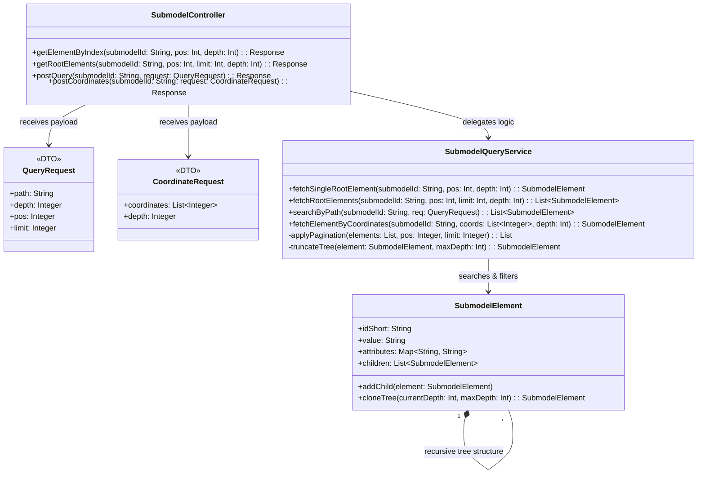

# UC04
## Team3-Basyx-Editor

## Version Control

| Version | Date       | Author                                | Comment       |
| ------- | ---------- | ------------------------------------- | ------------- |
| 1.0     | 27.10.2026 | Leonardo Risatti and Felix Bandl | First version |
| 1.0     | 27.10.2026 |  Felix Bandl | Structure Document and not Implemented |

## Table of Contents

1. [Current Situation](#1-current-situation)
    - 1.1 [Introduction & Problem Statement](#11-introduction--problem-statement)
    - 1.2 [Not Implemented Yet (Reasons)](#12-not-implemented-yet-reasons)
2. [Technical Implementation](#2-technical-implementation)
    - 2.1 [Filter Dimensions (Core Concepts)](#21-filter-dimensions-core-concepts)
    - 2.2 [REST Endpoints](#22-rest-endpoints)
    - 2.3 [Backend Architecture (UML Class Diagram)](#23-backend-architecture-uml-class-diagram)
    - 2.4 [Processing Flow (Backend Logic)](#24-processing-flow-backend-logic)


## 1. Current Situation

### 1.1 Introduction & Problem Statement

In BaSyx-based Industry 4.0 environments, data is often stored as large, hierarchical files (for example, complex KBL or XML structures as submodels). For machine-to-machine (M2M) communication, downloading complete files is inefficient.

This REST API solves that problem by allowing machines to query specific subtrees or individual elements of a submodel. The backend dynamically filters the data structure and returns only the exact requested XML/JSON structure.
This significantly reduces required bandwidth and client-side processing effort.

### 1.2 Not Implemented (Reasons)

XML response support has not been implemented because there is no direct access to the backend code and the exact target XML structure is unknown.


## 2. Technical Implementation

### 2.1 Filter Dimensions (Core Concepts)

The API uses four dimensions to precisely narrow down the returned data volume. These dimensions can be combined depending on the selected endpoint.

#### Path (`path`) - Navigation

An optional search string (for example XPath like `//Cartesian_point`) to find specific elements deep inside the submodel. If no path is provided, the request refers to the main elements (root level) of the submodel.

#### Coordinates (`coordinates`) - Strict Index Path

An array of integer values representing a direct parent-child path (breadcrumb path), for example `[0, 2, 1]`. Used for exact structural addressing when element names or XPath expressions are unknown.

#### Depth (`depth`) - Vertical Filtering

Defines how many tree levels below the found element should be returned.

- `0`: Only the node itself (including attributes), no children.
- `1`: The node plus its direct children.
- `-1` (or omitted): The full tree from this node onward.

#### Pagination (`pos` & `limit`) - Horizontal Filtering

- `pos` (integer, optional): Start index (0-based). Defines from which hit/element the response begins. Default: `0`.
- `limit` (integer, optional): Maximum number of returned elements on this level. If omitted, all elements from `pos` onward are returned.

### 2.2 REST Endpoints

#### A. Index-Based Addressing (The M2M Shortcut)

The most efficient method for machines to access a specific root element directly and without any search algorithm.

Request: `GET /api/submodels/{submodelId}/elements/{pos}?depth={depth}`

Example: `GET /api/submodels/kbl_123/elements/1?depth=3`

Behavior: The backend directly accesses the second element (`pos=1`) on the top level and returns it including three levels of its children.

#### B. Root-Level Query (List Query)

Used to browse the submodel from the top level without knowing a specific node index.

Request: `GET /api/submodels/{submodelId}?pos={pos}&limit={limit}&depth={depth}`

Example: `GET /api/submodels/kbl_123?pos=0&limit=5&depth=0`

Behavior: Returns the first five root elements of the submodel, but without their child elements (`depth=0`).

#### C. Advanced Query Request (Deep Search via POST)

Used when searching specifically by element names or attributes (via path). POST is used to avoid URL length limits (`414 URI Too Long`) for complex paths.

Request: `POST /api/submodels/{submodelId}/query`

Body (JSON payload):

```json
{
  "path": "//Harness[@id='id_328_0']/Connector_occurrence",
  "depth": 0,
  "pos": 10,
  "limit": 2
}
```

Behavior: Searches all elements that match the path. Skips the first ten hits, takes the next two, and removes all child nodes.

#### D. Coordinate-Based Addressing (Deep Index via POST)

Used when machines need to address a specific element deep in the tree using only numbers, while guaranteeing strict parent-child reliability. Instead of a potentially error-prone URL string, a POST request sends a strict coordinate array to ensure type safety.

Request: `POST /api/submodels/{submodelId}/elements/by-coordinates`

Body (JSON):

```json
{
    "coordinates": [0, 2, 1],
    "depth": 0
}
```

Behavior: The backend traverses the tree exactly along the provided integer array (1st root element -> 3rd child -> 2nd child) and returns exactly this element. For invalid indices (out of bounds), the operation immediately fails with a `404` or `400` error.

### 2.3 Backend Architecture (UML Class Diagram)

The following diagram shows the responsible backend classes. The tree structure is represented by the Composite Pattern in the `SubmodelElement` class.



### 2.4 Processing Flow (Backend Logic)

No matter which endpoint is called, the backend always follows an efficient three-step logic.

#### Step 1: Identification (Finding Elements)

- For index-based addressing: Direct array access `rootList.get(pos)` (complexity `O(1)`).
- For coordinate-based addressing: Tree traversal via the strict index array `rootList.get(coords[0]).getChildren().get(coords[1])...` (complexity `O(d)`, where `d` is the depth of the target).
- For POST query: Execute the search logic (for example XPath) over the full in-memory tree, producing a list of matches.

#### Step 2: Slicing (Horizontal Trimming)

The `applyPagination` method applies the optional offset (`pos`) and optional `limit` to the result list. If both are omitted, the full result list is kept. Otherwise, everything outside the defined window is discarded.

#### Step 3: Pruning (Vertical Trimming)

For each element in the final list, `truncateTree()` (or `cloneTree()`) is called. The algorithm traverses the subtree downward and stops at the level defined by `depth`. Everything below that level is removed from the object. The result is then sent to the machine as XML or JSON.

