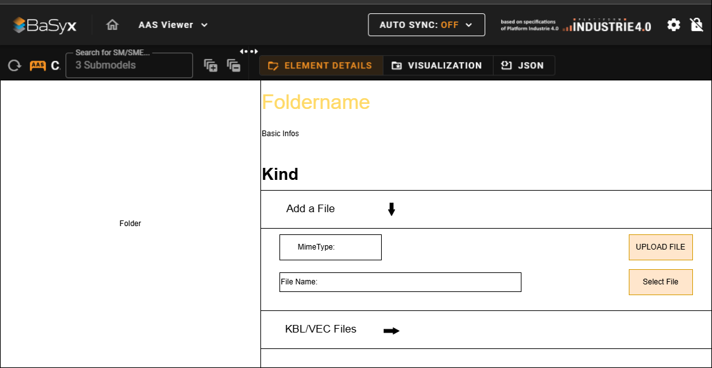
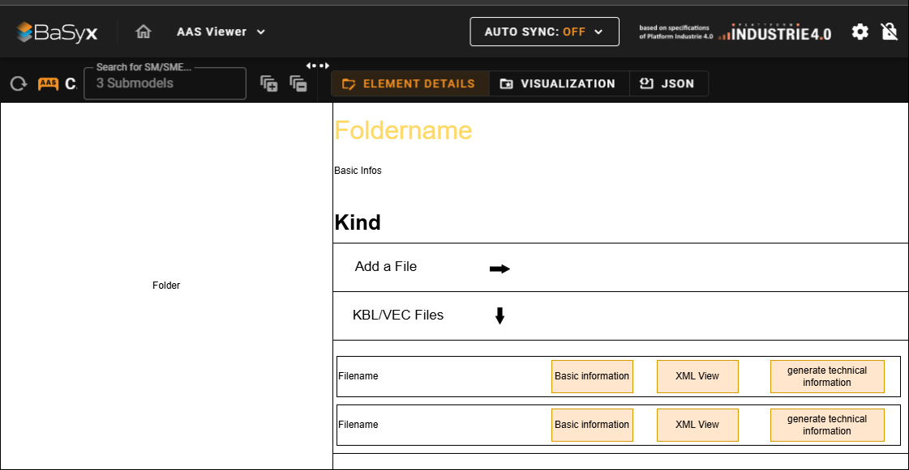
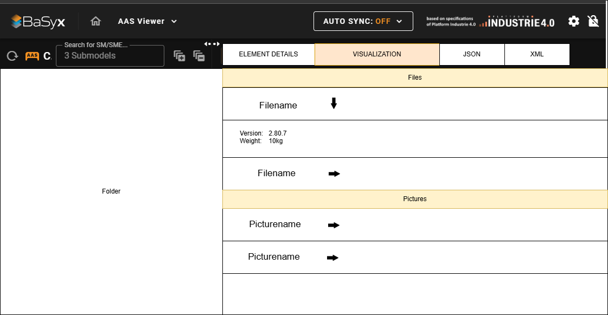
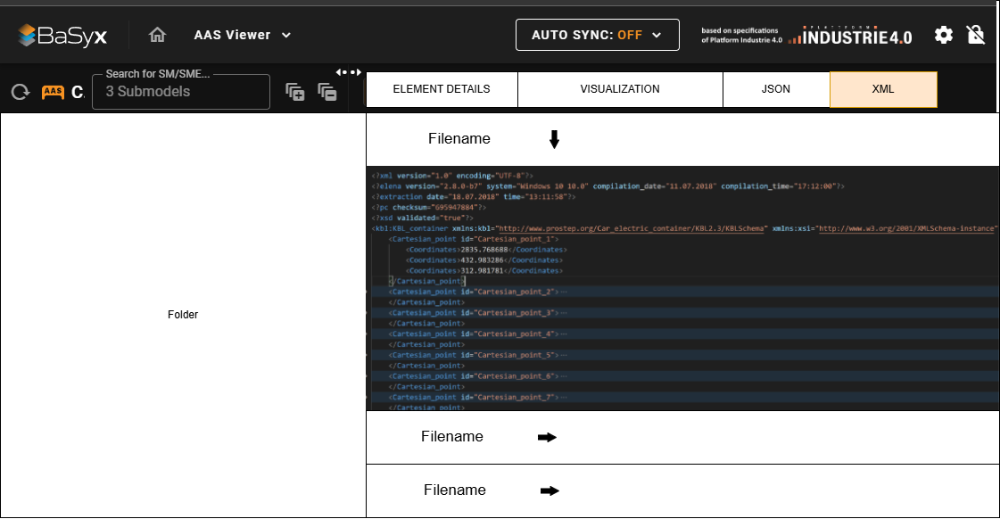

# Wireframe
## Team3-Basyx-Editor

## Version Control

|Version|Date|Author|Comment|
|-----|-----------|------------|---------------------|
|1.0|Datum|Felix Bandl|first version|
|1.1|Datum|Name|Kommentar1|
|1.2|Datum|Name|Kommentar2|
|1.3|Datum|Name|Kommentar3|
|1.4|Datum|Name|Kommentar4|

## Table of contents
1. [View to upload a file](#1-view-to-upload-a-file-eg-kbl-img)
2. [View to see the uploaded files](#2view-to-see-the-uploaded-files)
3. [View for "relevant technical data"](#3-view-for-relevant-technical-data)
4. [XML view](#4-xml-view)
5. [Error message design](#5-error-message-design)

# 1. View to upload a file (e.g. KBL, img):
- After the basic description follow so-called "accordion"

# 2.View to see the uploaded files:

# 3. View for "relevant technical data"

# 4. XML view

- For the XML view an additional tab was added analogous to the JSON view

# 5. Error message design
- should appear in the same place as before
- is now an example of an upload error
- but should also appear in the same format for other cases

