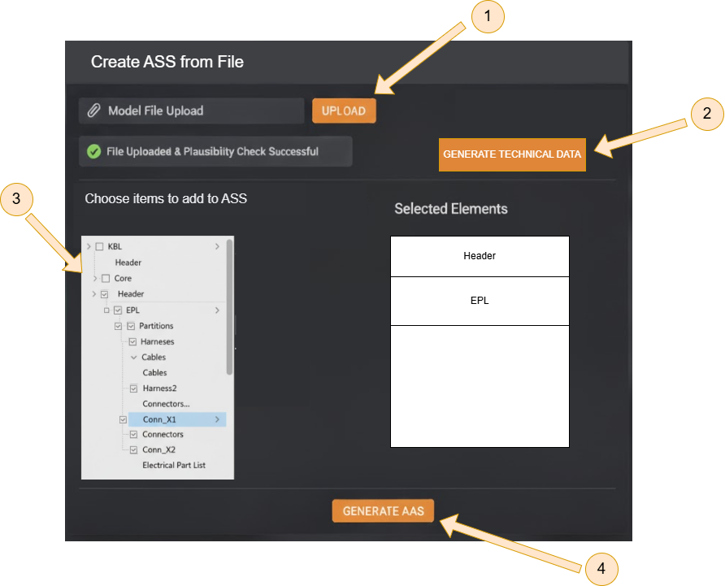

# Wireframe
## Team3-Basyx-Editor

## Version Control

|Version|Date|Author|Comment|
|-----|-----------|------------|---------------------|
|1.0|27.10.2025|Felix Bandl|first version|
|1.1|01.11.2025|Felix Bandl|adjusted after consultation with Mr. Rentschler|
|1.2|03.11.2025|Felix Bandl|minor change in point 2.2|
|1.3|Datum|Name|Kommentar3|
|1.4|Datum|Name|Kommentar4|

## Table of contents
1. [UC02 XML viewer with navigation and display functions](#1-uc02-xml-viewer-with-navigation-and-display-functions)
2. [UC03 AAS generator from KBL/VEC](#2-uc03-aas-generator-from-kblvec)
    - 2.1 [Select Upload](#21-select-upload)
    - 2.2 [Generate AAS file](#22-generate-aas-file)
3. [Error message design](#3-error-message-design)

## 1. UC02 XML viewer with navigation and display functions:

## 2. UC03 AAS generator from KBL/VEC
### 2.1 Select Upload
1. Click on the 3-dot menu
2. Choose `Create AAS from File`

### 2.2 Generate AAS file
1. Upload a KBL/VEC file with the button `UPLOAD`
2. Click on `GENERATE TECHNICAL DATA` after the green checkmark is displayed (=validity check successfully completed).
3. The information entered in the document is automatically filled into the fields. The user can change the information or add missing details.
4. Choose the elements you want to have in the ASS.
5. Generate an AS using the button `GENERATE AAS`. A new AAS is then generated, in which all user-selected supported data from the model file are mapped as sub-model elements. The created AAS is stored on the VWS server.

 
## 3. Error message design
- should appear in the same place as before
- is now an example of an upload error
- but should also appear in the same format for other cases

